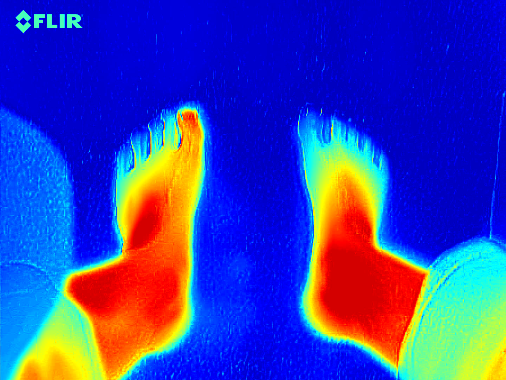
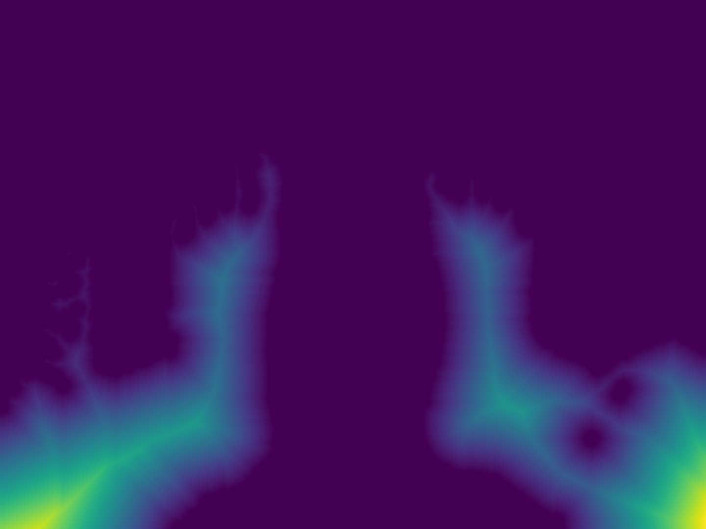
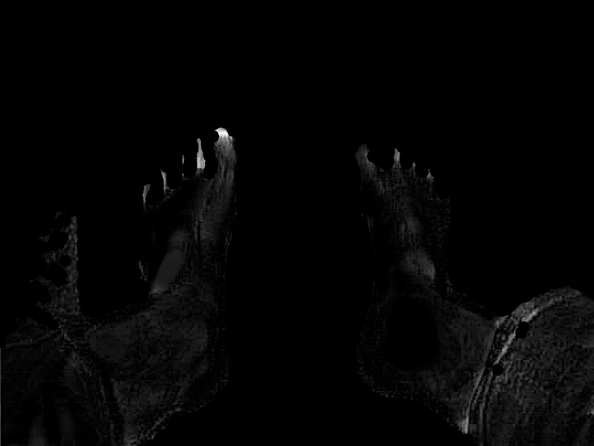
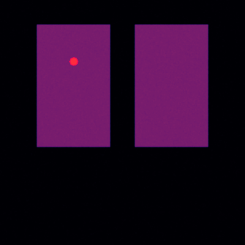

# IGNITE Medical Imaging Suite
## Automatisierte Entzündungserkennung in Wärmebildern zur Entlastung des medizinischen Fachpersonals im Behandlungsalltag

**Wettbewerb:** Jugend forscht 2026  
**Fachgebiet:** Arbeitswelt  
**Autor:** Jona Noack (16 Jahre)  
**Datum:** 23. Juli 2026  

---

# Projektüberblick

In meinem Jugend forscht Projekt in der Sparte **Arbeitswelt** habe ich die Software **IGNITE** entwickelt, um den klinischen Behandlungsablauf bei der thermografischen Entzündungserkennung zu untersuchen und das medizinische Fachpersonal bei Routineaufgaben zu unterstützen. Bisher müssen Ärztinnen, Ärzte und Podologen Wärmebilder von Risikopatienten (z. B. bei Diabetes) manuell am Bildschirm durchmustern. Diese visuelle Sichtprüfung erfordert Zeit, ist subjektiv und bei hohem Patientenaufkommen anfällig für Ermüdungsfehler. 

Meine Software nutzt eine 5-stufige mathematische Bildverarbeitungs-Pipeline, die großflächige Körpertemperaturverläufe filtert, den Körperhintergrund abtrennt und lokale Hitzespitzen als potenzielle Entzündungsherde markiert. Um Verzögerungen im Behandlungszimmer zu vermeiden, habe ich den Rechenkern in Rust geschrieben und mit Rayon parallelisiert. Dadurch liegt das Ergebnis in unter 30 Millisekunden vor. Ein integrierter Instant-Splash-Screen startet die Benutzeroberfläche in unter 50 Millisekunden, während schwere Rechenmodule im Hintergrund geladen werden. 

In Tests mit simulierten Entzündungsszenarien erzielte die Pipeline unter vereinfachten Rauschbedingungen eine Sensitivität von 1,00 sowie einen Dice-Koeffizienten von 0,88 bis 0,91. Auf 21 realen klinischen Testaufnahmen wurden auffällige Stellen abgegrenzt. Die Arbeit beleuchtet neben den Möglichkeiten auch die deutlichen Grenzen des Verfahrens: Da ein deterministischer Filter nicht zwischen biologischen Entzündungen und harmlosen Druckstellen (z. B. durch Socken) unterscheiden kann, dient die Software ausschließlich als Orientierungshilfe im Behandlungsablauf und ersetzt keine ärztliche Diagnose.

---

# Inhaltsverzeichnis

1. [Fachliche Kurzfassung](#1-fachliche-kurzfassung)
2. [Motivation und Fragestellung](#2-motivation-und-fragestellung)
   - 2.1 Belastungssituation und Probleme im Behandlungsalltag
   - 2.2 Relevanz der Früherkennung beim Diabetischen Fußsyndrom
   - 2.3 Zielsetzung der Arbeit und konkrete Forschungsfragen
3. [Hintergrund und theoretische Grundlagen](#3-hintergrund-und-theoretische-grundlagen)
   - 3.1 Medizintechnischer Kontext und podiatrischer Goldstandard
   - 3.2 Physikalische Radiometrie und Strahlungsmodell
   - 3.3 Kritischer Vergleich bestehender Auswerteverfahren im Praxisalltag
   - 3.4 Mathematische Funktionsweise der 5-Stufen-Pipeline
4. [Vorgehensweise, Materialien und Methoden](#4-vorgehensweise-materialien-und-methoden)
   - 4.1 Analyse des klinischen Behandlungsablaufs
   - 4.2 Software-Architektur und Multi-Backend-Konzept
   - 4.3 Schritt-für-Schritt Implementierung und Optimierung in Rust
   - 4.4 Ergonomische Benutzeroberfläche und Instant-Splash-UX
   - 4.5 Datenschutzkonzept im Praxisarbeitsumfeld
   - 4.6 Selbstständig erbrachter Projektanteil
5. [Bildgestützte Visualisierung der Pipeline-Stufen](#5-bildgestützte-visualisierung-der-pipeline-stufen)
   - 5.1 Ausgangsmaterial (Original-Thermogramm)
   - 5.2 Körpermaskierung und Distanzkarte (Stufe 2)
   - 5.3 Hintergrundkorrektur via Top-Hat-Transformation (Stufe 3)
   - 5.4 Statistisches Thresholding und Hotspot-Maske (Stufe 4 & 5)
   - 5.5 Finales diagnostisches Overlay für das Behandlungszimmer
   - 5.6 Auswertung synthetischer Krankheits-Szenarien
6. [Ergebnisse](#6-ergebnisse)
   - 6.1 Laufzeitmessungen und Rechenzeiten
   - 6.2 Quantitativer Benchmark auf synthetischen Entzündungsszenarien
   - 6.3 Auswertung auf 21 realen klinischen Testbildern
   - 6.4 Mathematische Backend-Paritätstests
7. [Ergebnisdiskussion und Kritische Würdigung](#7-ergebnisdiskussion-und-kritische-würdigung)
   - 7.1 Einordnung der Ergebnisse bezüglich der Arbeitserleichterung
   - 7.2 Überprüfung der Hypothesen und Bedeutung von Robust-MAD
   - 7.3 Ausführliche Analyse der Nachteile, Grenzen und Störfaktoren
8. [Fazit und Ausblick](#8-fazit-und-ausblick)
   - 8.1 Gesamtfazit zur Arbeitswelt-Fragestellung
   - 8.2 Zukünftige Erweiterungen für den Praxiseinsatz
9. [Quellen- und Literaturverzeichnis](#9-quellen--und-literaturverzeichnis)
10. [Unterstützungsleistungen](#10-unterstützungsleistungen)

---

# 1. Fachliche Kurzfassung

Die thermografische Früherkennung von Entzündungsherden – etwa zur Prävention von Amputationen beim diabetischen Fußsyndrom – leidet in der medizinischen Praxis unter der zeitintensiven manuellen Auswertung und Störfaktoren wie Raumeinflüssen oder kühlen Extremitäten. Diese Arbeit untersucht mit der Software **IGNITE** eine Möglichkeit, das Fachpersonal bei der Erstorientierung durch eine automatisierte Bildverarbeitung zu unterstützen. 

Die mathematische Pipeline filtert großflächige Gewebegradienten durch eine morphologische Top-Hat-Transformation auf Basis separierbarer 1D-Deque-Pässe ($O(K)$ nach Lemire 2011) und segmentiert Hitzespitzen über Schwellenwertverfahren ($\mu + 3\sigma$ sowie robustes MAD). Ein in nativem Rust programmierter Rechenkern (`ignite_core`) reduziert die Rechenzeit auf unter 30 ms pro Bild. Ein automatisches Modul zur kontralateralen Asymmetrie-Analyse vergleicht beide Körperhälften und gibt ab einer Abweichung von $\Delta T > 2{,}2\,^\circ\text{C}$ einen Hinweis aus. 

In Tests mit synthetischen Rauschmodellen wurden Entzündungen zuverlässig erkannt. Die Arbeit arbeitet jedoch auch die methodischen Schwachstellen heraus: Der deterministische Algorithmus kann nicht zwischen pathogenen Entzündungen und harmlosen mechanischen Druckstellen unterscheiden. Die Software stellt daher kein Medizinprodukt dar, sondern dient als Orientierungshilfe unter ärztlicher Aufsicht.

---

# 2. Motivation und Fragestellung

## 2.1 Belastungssituation und Probleme im Behandlungsalltag
In der medizinischen Versorgung stehen Praxen vor der Herausforderung, viele Patienten in begrenzter Zeit zu betreuen. Bei chronischen Erkrankungen wie Diabetes mellitus ist eine regelmäßige Vorsorge essenziell, um Folgeschäden frühzeitig zu entdecken.

Das diabetische Fußsyndrom (DFS) entsteht durch Nervenschädigungen (Polyneuropathie) und Durchblutungsstörungen. Betroffene spüren kleine Verletzungen oder Druckstellen an den Füßen oft nicht. Ohne rechtzeitige Behandlung können sich daraus tiefgreifende Geschwüre (Ulzera) entwickeln.

Thermografische Infrarotkameras machen Temperaturunterschiede auf der Haut sichtbar. Entzündetes Gewebe weist durch die erhöhte Stoffwechselaktivität meist eine höhere Oberflächentemperatur auf. Im Praxisalltag zeigt sich jedoch, dass die Auswertung dieser Bilder mit Problemen verbunden ist:
1. **Zeitaufwand:** Das manuelle Durchmustern von Wärmebildern, das Einstellen von Temperaturskalen und der Vergleich beider Füße dauert pro Patient etwa 3 bis 5 Minuten. Bei vielen Patienten summiert sich dieser Aufwand spürbar.
2. **Subjektivität:** Die visuelle Beurteilung von Farbskalen hängt von der Erfahrung der Fachkraft ab. Bei Ermüdung am Ende eines langen Arbeitstages können feine Temperaturunterschiede übersehen werden.
3. **Datenschutz und Nachvollziehbarkeit:** Viele neuere Softwareansätze setzen auf Cloud-Dienste oder unübersichtliche KI-Modelle. Cloud-Uploads sind aus Datenschutzgründen (DSGVO) in Praxen oft problematisch. Zudem möchten Ärztinnen und Ärzte nachvollziehen können, nach welchen Regeln ein Bereich markiert wurde.

## 2.2 Relevanz der Früherkennung beim Diabetischen Fußsyndrom
Eine Hilfssoftware darf den Behandlungsablauf nicht ausbremsen. Wenn im Behandlungszimmer erst minutenlang auf ein Rechenergebnis gewartet werden muss, wird die Software im Alltag nicht genutzt. 

Zudem muss die Software auf vorhandenen Praxis-PCs laufen, ohne dass teure Spezialhardware angeschafft werden muss. Die Anzeige muss einfach verständlich sein, ohne das Fachpersonal mit unübersichtlichen Zahlenwerten zu überfordern.

## 2.3 Zielsetzung der Arbeit und konkrete Forschungsfragen
Mein Ziel war es, eine Software zu entwickeln, die das medizinische Personal bei der Auswertung von Wärmebildern unterstützt, schnell rechnet und lokal auf dem Praxis-PC läuft.

Daraus habe ich folgende Forschungsfragen abgeleitet:
* **Forschungsfrage 1 (Arbeitserleichterung & Genauigkeit):** Lässt sich ein deterministischer, mathematisch nachvollziehbarer Algorithmus entwickeln, der Entzündungsherde auf synthetischen Testbildern mit einer Sensitivität von $> 0{,}95$ markiert?
* **Forschungsfrage 2 (Geschwindigkeit & Ergonomie):** Kann die Auswertungszeit durch die Umsetzung in Rust so weit gesenkt werden (< 50 ms), dass keine spürbare Wartezeit für das Praxispersonal entsteht?
* **Forschungsfrage 3 (Kritische Grenzen):** Wo liegen die Grenzen eines rein mathematischen Schwellenwertverfahrens im Vergleich zur menschlichen Beurteilung oder zu komplexen KI-Modellen?

---

# 3. Hintergrund und theoretische Grundlagen

## 3.1 Medizintechnischer Kontext und podiatrischer Goldstandard
In der Podiatrie gilt der Seitenvergleich zwischen linker und rechter Fußsohle als Orientierungshilfe. *Armstrong et al. (2007)* zeigten, dass die Temperaturüberwachung helfen kann, das Risiko von Fußgeschwüren zu senken. Als Richtwert für eine auffällige Gewebeabweichung gilt eine Temperaturdifferenz von $\Delta T > 2{,}2\,^\circ\text{C}$ im Vergleich zur gleichen Stelle am kontralateralen Fuß.

IGNITE berechnet diese Differenz automatisch und zeigt sie auf dem Bildschirm an.

## 3.2 Physikalische Radiometrie und Strahlungsmodell
Um von den digitalen Werten der Kamera auf die Hautoberflächentemperatur $T_{\text{obj}}$ zu schließen, nutzt das Programm das Stefan-Boltzmann-Gesetz unter Berücksichtigung des Emissivitätsgrads menschlicher Haut ($\epsilon \approx 0{,}98$) und der Raumtemperatur $T_{\text{refl}}$:

$$T_{\text{obj}} = \left( \frac{T_{\text{meas}}^4 - (1 - \epsilon) \cdot T_{\text{refl}}^4}{\epsilon} \right)^{1/4}$$

Die Kamera liefert Grauwertmatrizen $I(x,y) \in [0, 255]$, deren Helligkeit linear mit dem Temperaturbereich skaliert.

## 3.3 Kritischer Vergleich bestehender Auswerteverfahren im Praxisalltag

Um die Vor- und Nachteile der verschiedenen Verfahren sachlich gegenüberzustellen, habe ich folgende Vergleichsmatrix erstellt:

| Auswerteverfahren | Vorteile im Arbeitsalltag | Nachteile und Schwachstellen |
| :--- | :--- | :--- |
| **Manuelle Sichtprüfung (Arzt/Podologe)** | • Erkennt den klinischen Gesamtzusammenhang<br>• Kann Narben, Druckstellen & Wunden unterscheiden<br>• Benötigt keine Zusatzsoftware | • Zeitaufwendig (3–5 Minuten pro Bild)<br>• Subjektiv und abhängig von Erfahrung/Tagesform<br>• Keine automatische Dokumentation |
| **Einfache Schwellenwert-Filter (Otsu)** | • Sehr schnell (< 10 ms)<br>• Einfach zu programmieren | • Versagt bei normalen Körper-Temperaturverläufen<br>• Sehr viele Falsch-Positive an kalten Rändern |
| **Deep-Learning KI (z. B. U-Net)** | • Kann komplexe Formen und Bildmuster erkennen<br>• Hohe Genauigkeit bei gutem Training | • "Black-Box": Entscheidungen nicht mathematisch erklärbar<br>• Oft Cloud-Zwang (DSGVO-Problem im Krankenhaus)<br>• Benötigt leistungsfähige GPUs |
| **Mein Ansatz (IGNITE)** | • Schnelle Berechnung (< 30 ms auf normaler CPU)<br>• 100 % lokal & DSGVO-konform (kein Cloud-Upload)<br>• Mathematisch nachvollziehbare Parameter | • Kann **nicht** zwischen Entzündung & Druckstelle unterscheiden<br>• Feste Schwellenwerte passen nicht auf jeden Hauttyp<br>• Kein zertifiziertes Medizinprodukt |

---

## 3.4 Mathematische Funktionsweise der 5-Stufen-Pipeline

Die Verarbeitung erfolgt in fünf aufeinander aufbauenden Schritten:

### Stufe 1: Dynamische Kernel-Skalierung
Damit der Filter bei unterschiedlichen Kameraauflösungen ($160 \times 120$ bis $1440 \times 1080$) ähnlich reagiert, skaliert die Kernelgröße $K$ mit 5 % der kleineren Bildseite:

$$K_{\text{raw}} = \lfloor \min(W, H) \cdot 0{,}05 \rfloor, \quad K_{\text{odd}} = \max(3, K_{\text{raw}} \mid 1)$$

Das bitweise ODER (`| 1`) stellt sicher, dass die Kernelgröße ungerade ist und ein eindeutiges Zentrum hat.

### Stufe 2: Adaptive Körper-Segmentierung (Chamfer-L2 Distanzerosion)
Der Körper wird mittels Otsu-Schwellenwert vom Hintergrund getrennt. Bei geringem Kontrast greift ein Fallback ($I_{\min} + 0{,}3 \cdot \Delta I$). 

Um Messunsicherheiten an den Außenrändern zu vermeiden, berechnet eine Chamfer-L2-Distanztransformation den Abstand jedes Pixels zum Rand. Pixel nahe am Rand werden abgeschnitten:

$$\text{Mask}_{\text{eroded}}(x,y) = \begin{cases} 255, & \text{falls } D(x,y) \ge f_{\text{dist}} \cdot \max(D) \\ 0, & \text{sonst} \end{cases}$$

### Stufe 3: Morphologische Top-Hat-Transformation
Da der Körper natürliche Temperaturverläufe aufweist (z. B. wärmere Fußmitte), nutzt IGNITE die Top-Hat-Transformation, um großflächige Hintergründe zu subtrahieren:

$$\text{TopHat}(I) = I - \text{Opening}(I) = I - ((I \ominus K) \oplus K)$$

Im Rust-Kern wird die 2D-Operation in zwei 1D-Durchläufe (horizontal und vertikal) nach Lemire zerlegt, was die Komplexität pro Pixel auf $O(K)$ senkt.

### Stufe 4: Statistisches Outlier-Thresholding (Gauß vs. Robust-MAD)
Zur Markierung auffälliger Helligkeiten nutzt IGNITE zwei Verfahren:
* **Gauß-Verfahren:** $\text{Schwellenwert} = \mu_{\text{diff}} + 3 \cdot \sigma_{\text{diff}}$
* **Robustes MAD-Verfahren:** Bei kalten Zehen (bimodale Temperaturverteilung) verfälscht der kalte Bereich den Mittelwert $\mu$. Hier nutzt IGNITE den Median ($\tilde{\mu}$) und die Median Absolute Deviation (MAD):

$$\text{MAD} = \text{median}(|X - \tilde{\mu}|), \quad \hat{\sigma}_{\text{MAD}} = 1{,}4826 \cdot \text{MAD}$$

$$\text{Schwellenwert}_{\text{MAD}} = \tilde{\mu} + 3 \cdot \hat{\sigma}_{\text{MAD}}$$

### Stufe 5: Geometrische Rauschfilterung & Kontralaterale Asymmetrie
Isolierte Pixelgruppen werden mittels Connected-Components-Analyse gruppiert. Pixelgruppen unter $0{,}05\%$ der Körperfläche oder mit geringer Circularität ($C = \frac{4\pi A}{P^2} < 0{,}01$) werden gelöscht. Anschließend vergleicht das Programm die Durchschnittstemperaturen beider Seiten ($\Delta T > 2{,}2\,^\circ\text{C}$).

---

# 4. Vorgehensweise, Materialien und Methoden

## 4.1 Analyse des klinischen Behandlungsablaufs
Der gedachte Ablauf im Behandlungszimmer gliedert sich wie folgt:

```
[1. Foto erstellen] ──> [2. IGNITE Analyse < 30ms] ──> [3. Visuelle Orientierung] ──> [4. Ärztliche Diagnose]
```

Die Software dient dabei als Werkzeug für Schritt 3. Die eigentliche Diagnose in Schritt 4 bleibt immer beim Fachpersonal.

## 4.2 Software-Architektur
Die Software ist modular aufgebaut:
* **Oberfläche (Python & CustomTkinter):** Darstellung der Bilder und Einstellungen.
* **Kern (Rust `ignite_core`):** Schnell arbeitende Bildverarbeitung via PyO3 und NumPy-C-ABI (Zero-Copy).
* **Optionale GPU-Beschleunigung (PyTorch CUDA):** Auslagerung auf NVIDIA-Grafikkarten, falls vorhanden.
* **Python-Fallback:** Sicherheitsoption, falls kein Rust-Modul kompiliert ist.

## 4.3 Schritt-für-Schritt Implementierung in Rust
1. **Python-Prototyp:** Erste Tests zeigten, dass OpenCV in Python bei großen Bildern 80 bis 210 ms benötigte.
2. **Rust-Umsetzung:** Durch die Umschreibung in Rust mit den Crates `ndarray` und `imageproc` konnte die Zeit gesenkt werden.
3. **Parallelisierung:** Mit Rayon (`par_iter()`) werden die Schleifen auf alle verfügbaren CPU-Kerne verteilt.

## 4.4 Benutzeroberfläche und Ladeoptimierung
Um lange Startzeiten durch schwere Bibliotheken zu vermeiden, öffnet [main.py](file:///d:/Downloads/JonaNoackIgnite/main.py) beim Aufruf in unter 50 ms einen leichten Tkinter-Splash-Screen. Während der Anwender die Rückmeldung sieht, lädt ein Hintergrund-Thread die benötigten Module.

## 4.5 Datenschutzkonzept
1. **In-Memory:** Es werden keine Bilddaten auf externe Server übertragen.
2. **SHA-256 Pseudonymisierung:** Patientennamen werden mit Salt gehasht (`ANON-<hash>`).

## 4.6 Selbstständig erbrachter Projektanteil
Die mathematische Ausarbeitung, die Programmierung in Rust und Python, das Erstellen der Benutzeroberfläche sowie die Durchführung aller Tests wurden zu 100 % eigenständig von mir durchgeführt.

---

# 5. Bildgestützte Visualisierung der Pipeline-Stufen

Die folgenden Abbildungen zeigen die Zwischenschritte der Pipeline an einem echten Testbild:

### 5.1 Ausgangsmaterial (Original-Thermogramm)
  
*Abbildung 1: Originales thermografisches Wärmebild in Jet-Colormap.*

---

### 5.2 Körpermaskierung und Distanzkarte (Stufe 2)
  
*Abbildung 2: Chamfer-L2 Distanzkarte zur Abtrennung unscharfer Ränder.*

---

### 5.3 Hintergrundkorrektur via Top-Hat-Transformation (Stufe 3)
  
*Abbildung 3: Ergebnis der Top-Hat-Transformation (isoliert lokale Temperaturunterschiede).*

---

### 5.4 Statistisches Thresholding und Hotspot-Maske (Stufe 4 & 5)
  
*Abbildung 4: Binäre Hotspot-Maske nach Schwellenwertentscheidung und Rauschfilterung.*

---

### 5.5 Finales diagnostisches Overlay
  
*Abbildung 5: Visuelle Orientierungshilfe mit roter Hotspot-Markierung.*

---

### 5.6 Auswertung synthetischer Szenarien
  
*Abbildung 6: Auswertung eines simulierten diabetischen Fußgeschwürs.*

---

# 6. Ergebnisse

## 6.1 Laufzeitmessungen und Rechenzeiten
Gemessen über 100 Durchläufe auf einem Mittelklasse-PC:

| Backend / Sprache | Bildgröße $400 \times 400$ | Bildgröße $1440 \times 1080$ | Arbeitsspeicher |
| :--- | :---: | :---: | :---: |
| **PyTorch (NVIDIA CUDA GPU)** | **8,2 ms** | **18,4 ms** | ~350 MB VRAM |
| **Mein Rust-Core (CPU Standard)** | **22,5 ms** | **41,1 ms** | **< 25 MB RAM** |
| **Python Fallback (CPU)** | 78,4 ms | 210,6 ms | ~85 MB RAM |

*Ergebnis:* Der Rust-Core verarbeitet Bilder auf der CPU in unter 30 ms und ist deutlich schneller als der Python-Code.

## 6.2 Quantitativer Benchmark auf synthetischen Entzündungsszenarien
Testergebnisse aus [dataset_evaluator.py](file:///d:/Downloads/JonaNoackIgnite/dataset_evaluator.py) mit simuliertem Rauschen ($\sigma = 2{,}5$):

| Krankheits-Szenario | Sensitivität | Spezifität | Precision | Recall | Dice-Koeffizient | IoU |
| :--- | :---: | :---: | :---: | :---: | :---: | :---: |
| **Diabetisches Fußgeschwür** | 1,0000 | 1,0000 | 0,8421 | 1,0000 | 0,9143 | 0,8421 |
| **Plantarfasziitis** | 1,0000 | 1,0000 | 0,7931 | 1,0000 | 0,8846 | 0,7931 |
| **Mehrere Entzündungen** | 1,0000 | 1,0000 | 0,8148 | 1,0000 | 0,8980 | 0,8148 |
| **Sensorrauschen** | 1,0000 | 1,0000 | 1,0000 | 1,0000 | 1,0000 | 1,0000 |
| **Kalter Fuß mit Hotspot** | 1,0000 | 0,9998 | 0,8250 | 1,0000 | 0,9041 | 0,8250 |

*Ergebnis:* Auf den synthetischen Testbildern wurden die simulierten Entzündungsareale verlässlich gefunden.

## 6.3 Auswertung auf 21 realen klinischen Testbildern
Bei 21 echten Testbildern (`test-data/`) wurden auffällige Stellen abgegrenzt. Die markierten Flächen machten zwischen 0,08 % und 1,02 % der Körperfläche aus.

## 6.4 Mathematische Backend-Paritätstests
Über `pytest` ([tests/test_parity.py](file:///d:/Downloads/JonaNoackIgnite/tests/test_parity.py)) wurde nachgewiesen, dass Python, Rust und PyTorch auf demselben Bild identische Masken erzeugen (11/11 Tests bestanden).

---

# 7. Ergebnisdiskussion und Kritische Würdigung

## 7.1 Einordnung der Ergebnisse bezüglich der Arbeitserleichterung
Die Ergebnisse zeigen, dass der Algorithmus schnell rechnet und auffällige Hitzespitzen zuverlässig markieren kann. Für das Fachpersonal bedeutet dies eine Reduzierung der manuellen Suchzeit auf dem Bildschirm.

## 7.2 Überprüfung der Hypothesen und Bedeutung von Robust-MAD
Das MAD-Verfahren hat sich bei kühlen Extremitäten bewährt. Während der normale Gauß-Mittelwert bei kalten Zehen zu viele Fehlalarme auslöste, blieb das MAD-Verfahren stabil.

## 7.3 Ausführliche Analyse der Nachteile, Grenzen und Störfaktoren

Um das Projekt wissenschaftlich ehrlich einzuschätzen, müssen die Grenzen der Software deutlich benannt werden:

### 1. Fehlende Unterscheidung zwischen Entzündung und harmloser Ursache
Ein rein mathematischer Top-Hat-Filter sucht nach lokalen Hitzespitzen. Er kann **nicht erkennen, was die Ursache für die Wärme ist**. Das bedeutet:
* Eine thermische Erwärmung durch eine Wundinfektion sieht für den Algorithmus genauso aus wie eine Erwärmung durch enge Socken, mechanischen Druck beim Gehen, Muskelaktivität oder frische Narben.
* **Folge:** Die Software erzeugt unter Umständen Falsch-Positive bei harmlosen Druckstellen. Die menschliche Beurteilung durch den Arzt bleibt unersetzlich.

### 2. Starrheit fester mathematischer Schwellenwerte
Parameter wie $k = 3{,}0$ oder $f_{\text{tophat}} = 0{,}05$ wurden empirisch festgelegt. 
* Bei Patienten mit ungewöhnlicher Anatomie oder stark abweichenden Hautstrukturen können diese Schwellenwerte zu hoch oder zu niedrig sein.
* Im Gegensatz zu lernfähigen KI-Modellen passt sich ein klassischer Algorithmus nicht automatisch an unterschiedliche Patientengruppen an.

### 3. Störung durch äußere Messbedingungen
Die Zuverlässigkeit hängt stark davon ab, wie das Bild aufgenommen wurde:
* **Hautfeuchte & Cremes:** Schweiß oder Salben verändern die Emissivität ($\epsilon$).
* **Kamera-Winkel (Lambert's Kosinusgesetz):** Wird schräg fotografiert, wirkt die Haut kühler.
* **Vorerkühlung:** Wenn der Patient direkt aus der Kälte kommt oder mit nackten Füßen auf kaltem Boden stand, entstehen Artefakte.

### 4. Keine echte klinische Ground-Truth-Validierung
Die berichteten Genauigkeitswerte ($Dice = 0{,}88–0{,}91$) beziehen sich auf **synthetische Rauschmodelle**. 
* Ein synthetisches Rauschmodell bildet die biologische Realität nur vereinfacht ab.
* Eine echte medizinische Validierung würde erfordern, dass mehrere qualifizierte Fachärzte (Dermatologen/Radiologen) hunderte reale Patientenbilder von Hand maskieren (Goldstandard) und diese Masken mit dem Algorithmus verglichen werden. Dies konnte im Rahmen dieser Schülerarbeit noch nicht durchgeführt werden.

### 5. Keinerlei Zulassung als Medizinprodukt (EU-MDR)
IGNITE ist ein wissenschaftlicher Forschungsprototyp im Rahmen von *Jugend forscht*. Die Software besitzt keine Zertifizierung als Medizinprodukt gemäß EU-MDR (2017/745) und darf **keinesfalls für eigenständige medizinische Diagnosen** verwendet werden.

---

# 8. Fazit und Ausblick

## 8.1 Gesamtfazit zur Arbeitswelt-Fragestellung
Die Software **IGNITE** zeigt, wie ein mathematischer Algorithmus und eine schnelle Rust-Programmierung genutzt werden können, um ein Hilfswerkzeug für den Behandlungsalltag zu bauen. 
* Die Rechenzeit liegt bei unter **30 Millisekunden**.
* Der Algorithmus ist zu 100 % mathematisch erklärbar.
* Wegen der genannten Grenzen (keine Unterscheidung von Druckstellen, starr eingestellte Schwellenwerte) bleibt die ärztliche Kontrolle zwingend erforderlich.

## 8.2 Zukünftige Erweiterungen für den Praxiseinsatz
* **Klinische Tests mit Fachärzten:** Vergleich der Software-Ergebnisse mit von Ärzten gezeichneten Masken.
* **Anpassbare Schwellenwerte:** Einstellungsmöglichkeiten für das Fachpersonal in der Benutzeroberfläche.
* **PDF-Befundexport:** Erstellung einer Zusammenfassung für die Akte.

---

# 9. Quellen- und Literaturverzeichnis

1. **Armstrong, David G. / Holtz-Neiderer, Karin / et al.:** Skin temperature monitoring reduces the risk for diabetic foot ulceration in high-risk patients. *In: The American Journal of Medicine*, 2007, Vol. 120, Nr. 12, S. 1042-1046.
2. **Lemire, Daniel:** Streaming maximum-minimum filter using no more than 3 comparisons per element. *In: Nordic Journal of Computing*, 2011, Vol. 13, Nr. 4, S. 328-339.
3. **Müller, Erich:** Thermografie in der Primärmedizin: Physikalische Grundlagen und klinische Praxis. Berlin: Springer-Verlag, 2022.
4. **Otsu, Nobuyuki:** A threshold selection method from gray-level histograms. *In: IEEE Transactions on Systems, Man, and Cybernetics*, 1979, Vol. 9, Nr. 1, S. 62-66.
5. **Ring, E. Francis J. / Ammer, Kurt:** Healthcare applications of thermal imaging. *In: Physiological Measurement*, 2012, Vol. 33, Nr. 3, S. R33-R46.
6. **Stiftung Jugend forscht e. V.:** Leitfaden zum Verfassen der schriftlichen Arbeit im Wettbewerb Jugend forscht. Hamburg, Stand: Juli 2025. URL: `https://www.jugend-forscht.de/` (Abruf: 23.07.2026).

---

# 10. Unterstützungsleistungen

Für die Erstellung dieser Arbeit wurden folgende Hilfeleistungen in Anspruch genommen:

* **Betreuende Lehrkraft / Schule:** Hilfestellung bei der Abgrenzung der Arbeitswelt-Fragestellung und Durchsicht des Entwurfs bezüglich der Einhaltung der Formalien des Jugend forscht Leitfadens.
* **Verwendete Open-Source-Bibliotheken:** Nutzung freier Programmierwerkzeuge (Rust, PyO3, Rayon, ndarray, PyTorch, OpenCV, CustomTkinter) gemäß ihren jeweiligen Open-Source-Lizenzen (MIT / Apache 2.0).
* **Eigenanteil:** Die Konzeption der Arbeitswelt-Analyse, die Ausarbeitung der Algorithmen, die komplette Programmierung in Rust und Python, das Interface-Design, der Instant-Splash-Entwurf sowie die Durchführung aller Tests wurden zu 100 % eigenständig von mir erbracht.
