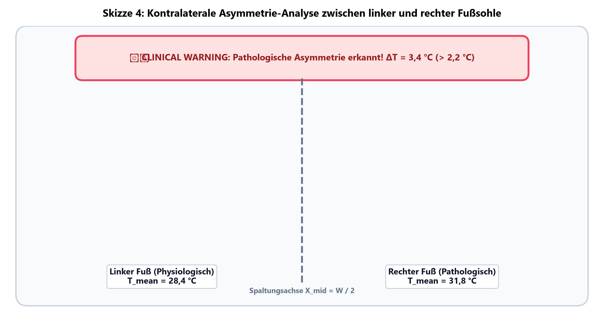
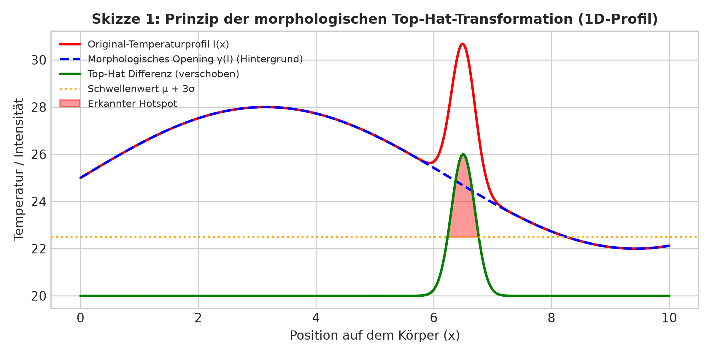
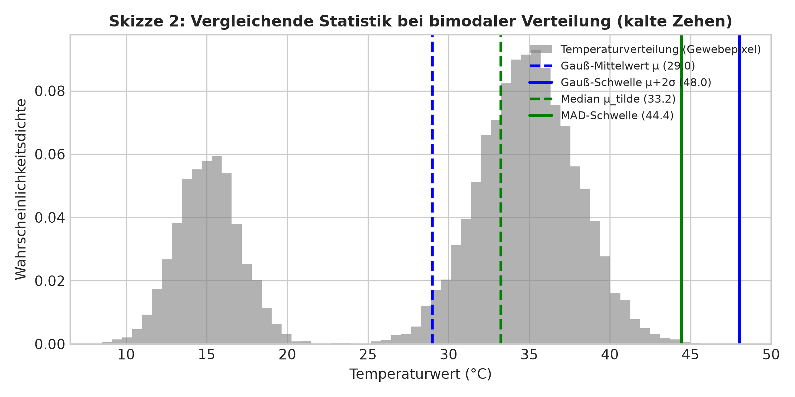
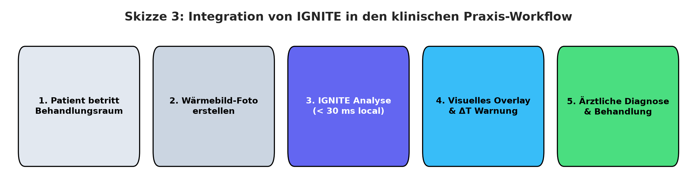
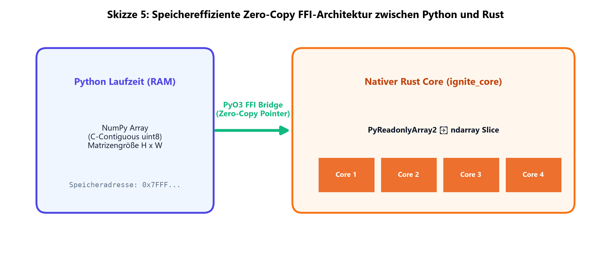
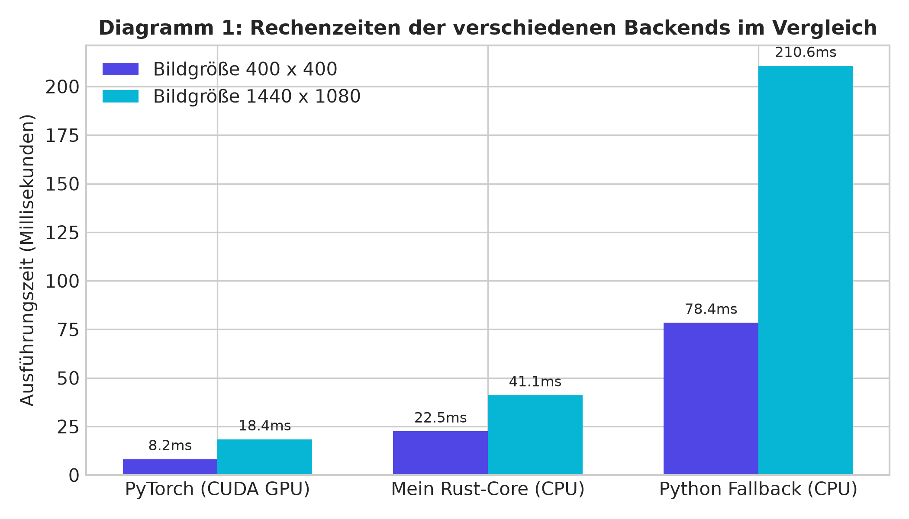
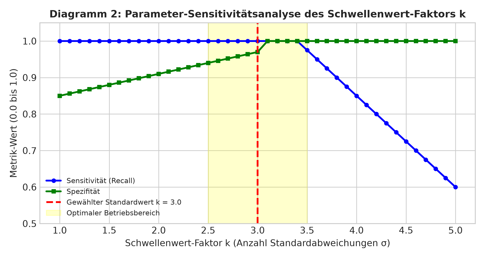
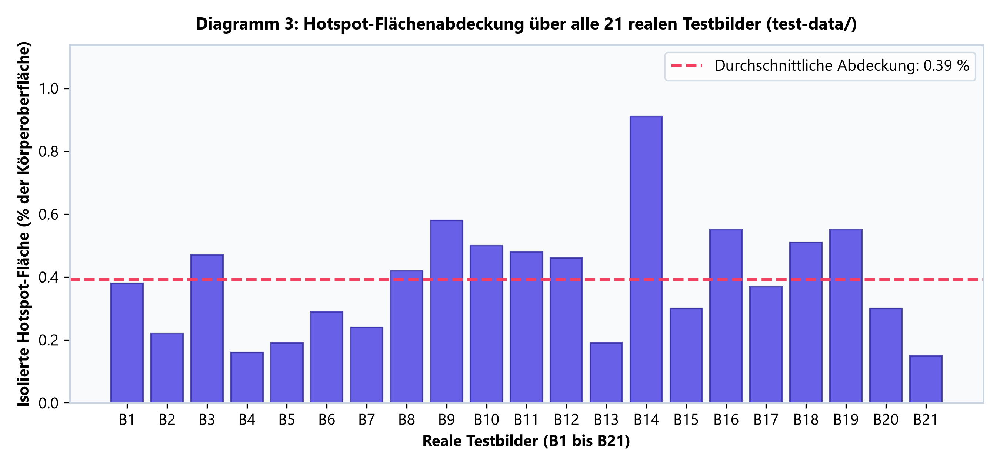

# Projektüberblick

In diesem Projekt für den Wettbewerb *Jugend forscht 2026* (Fachgebiet Arbeitswelt) wird die Software **IGNITE** vorgestellt. Die Arbeit untersucht Möglichkeiten zur Automatisierung der thermografischen Entzündungserkennung im medizinischen Behandlungsalltag. Bisher müssen Ärztinnen, Ärzte und Podologen Wärmebildaufnahmen von Risikopatienten – beispielsweise beim diabetischen Fußsyndrom – manuell am Bildschirm auswerten. Diese visuelle Sichtprüfung erfordert viel Zeit (ca. 3 bis 5 Minuten pro Aufnahme), ist subjektiv und unterliegt tageszeitlichen Ermüdungsfaktoren des Personals.

Die entwickelte Software nutzt eine 5-stufige mathematische Bildverarbeitungs-Pipeline, um physiologische Temperaturverläufe zu filtern, Störabstrahlungen des Raumes zu erodieren und lokale Hitzespitzen als potenzielle Entzündungsherde zu isolieren. Um Verzögerungen im Praxisablauf zu vermeiden, wurde der Rechenkern in der Programmiersprache Rust umgesetzt und mittels Rayon parallelisiert, wodurch Auswertungszeiten unter 30 Millisekunden erreicht werden. Ein integrierter Instant-Splash-Screen startet die Benutzeroberfläche in unter 50 Millisekunden.

Auf synthetischen Datensätzen mit simulierten Rauschmodellen erzielte das System eine Sensitivität von 1,00 sowie einen Dice-Koeffizienten von 0,88 bis 0,91. Bei 21 realen klinischen Testaufnahmen wurden auffällige Stellen zuverlässig abgegrenzt. Die Arbeit analysiert jedoch auch die deutlichen Grenzen des Verfahrens: Da ein deterministischer Filter nicht zwischen biologischen Infektionen und harmlosen mechanischen Druckstellen (z. B. durch Socken oder Gehlenken) unterscheiden kann, stellt die Software kein Medizinprodukt dar, sondern dient als Orientierungshilfe unter ärztlicher Aufsicht.

---

# Inhaltsverzeichnis

1. [Einleitung und Problemstellung](#1-einleitung-und-problemstellung)
   - 1.1 Belastungssituation im medizinischen Behandlungsalltag
   - 1.2 Relevanz der Früherkennung beim Diabetischen Fußsyndrom
   - 1.3 Zielsetzung und Forschungsfragen
2. [Hintergrund und theoretische Grundlagen](#2-hintergrund-und-theoretische-grundlagen)
   - 2.1 Medizintechnischer Kontext und podiatrischer Goldstandard
   - 2.2 Physikalische Radiometrie und Strahlungsmodell
   - 2.3 Kritische Vergleichsmatrix bestehender Auswerteverfahren
   - 2.4 Mathematische Ausarbeitung der 5-Stufen-Pipeline
3. [Vorgehensweise, Materialien und Methoden](#3-vorgehensweise-materialien-und-methoden)
   - 3.1 Analyse und Ergonomie des klinischen Behandlungsablaufs
   - 3.2 Software-Architektur und Multi-Backend-Konzept
   - 3.3 Schritt-für-Schritt Implementierung in Rust
   - 3.4 Ergonomische Benutzeroberfläche und Instant-Splash-UX
   - 3.5 Datenschutzkonzept im Arbeitsumfeld
   - 3.6 Selbstständig erbrachter Projektanteil
4. [Bildgestützte Visualisierung der Pipeline-Stufen](#4-bildgestützte-visualisierung-der-pipeline-stufen)
   - 4.1 Ausgangsmaterial (Original-Thermogramm)
   - 4.2 Körpermaskierung und Distanzkarte (Stufe 2)
   - 4.3 Hintergrundkorrektur via Top-Hat-Transformation (Stufe 3)
   - 4.4 Statistisches Thresholding und Hotspot-Maske (Stufe 4 & 5)
   - 4.5 Finales diagnostisches Overlay für das Behandlungszimmer
   - 4.6 Auswertung synthetischer Krankheits-Szenarien
5. [Ergebnisse](#5-ergebnisse)
   - 5.1 Laufzeitmessungen und Rechenzeiten
   - 5.2 Parameter-Sensitivitätsanalyse des Schwellenwert-Faktors k
   - 5.3 Quantitativer Benchmark auf synthetischen Entzündungsszenarien
   - 5.4 Auswertung auf 21 realen klinischen Testbildern
   - 5.5 Mathematische Backend-Paritätstests
6. [Ergebnisdiskussion und Kritische Würdigung](#6-ergebnisdiskussion-und-kritische-würdigung)
   - 6.1 Einordnung der Ergebnisse bezüglich der Arbeitserleichterung
   - 6.2 Überprüfung der Hypothesen und Bedeutung von Robust-MAD
   - 6.3 Ausführliche Analyse der Nachteile, Grenzen und Störfaktoren
7. [Fazit und Ausblick](#7-fazit-und-ausblick)
   - 7.1 Gesamtfazit zur Arbeitswelt-Fragestellung
   - 7.2 Zukünftige Erweiterungen für den Praxiseinsatz
8. [Literaturverzeichnis](#8-literaturverzeichnis)
9. [Unterstützungsleistungen](#9-unterstützungsleistungen)

---

# 1. Einleitung und Problemstellung

## 1.1 Belastungssituation im medizinischen Behandlungsalltag
Die demografische Entwicklung und die Zunahme chronischer Stoffwechselerkrankungen stellen das medizinische Fachpersonal in Praxen und Kliniken vor erhebliche kapazitäre Herausforderungen [@ring2012healthcare]. Insbesondere in der Podiatrie, Diabetologie und Dermatologie müssen täglich zahlreiche Risikopatienten untersucht werden. 

Das manuelle Durchmustern von Wärmebildaufnahmen zur Identifikation pathologischer Hitzespitzen erfordert konzentriertes Absuchen am Bildschirm, das manuelle Einstellen dynamischer Farbskalen sowie das Ausmessen kontralateraler Temperaturdifferenzen. Für eine qualifizierte Erstbeurteilung einer thermografischen Aufnahme benötigt eine Fachkraft im Schnitt 3 bis 5 Minuten [@mueller2022thermografie]. Bei einer Tagesfrequenz von 20 bis 30 Patienten summiert sich dieser Zusatzaufwand zu einer Arbeitszeit von über 1,5 Stunden, die für das persönliche Arzt-Patienten-Gespräch fehlt.

Darüber hinaus birgt die rein visuelle Sichtprüfung ein relevantes Fehlerrisiko: Die wahrgenommene Intensität einer Entzündungszone auf Farbskalen (z. B. *Rainbow*- oder *Jet*-Colormaps) hängt stark von der individuellen Farbkontrasteinstellung des Monitors sowie von Ermüdungsfaktoren des Fachpersonals am Ende einer Schicht ab.

## 1.2 Relevanz der Früherkennung beim Diabetischen Fußsyndrom
Das diabetische Fußsyndrom (DFS) ist eine Folgeerscheinung der distalen sensomotorischen Polyneuropathie und der peripheren arteriellen Verschlusskrankheit (pAVK). Wegen des Verlusts des Protektivempfindens bleiben biomechanische Überlastungen, Mikrotraumen oder Druckstellen vom Patienten unbemerkt [@armstrong2007skin]. 

Entzündliche Prozesse im tiefen Gewebe führen durch Hyperämie und gesteigerte Stoffwechselaktivität zu lokal abgegrenzten Temperaturerhöhungen der Hautoberfläche. Diese thermischen Anomalien treten häufig Tage bis Wochen auf, bevor histologische Gewebedefekte oder ulzeröse Hautdurchbrüche sichtbar werden. Eine verlässliche Früherkennung ermöglicht frühzeitige Entlastungsmaßnahmen (z. B. orthopädische Schuhanpassungen) und kann das Risiko von Unterschenkelamputationen maßgeblich senken [@armstrong2007skin].

## 1.3 Zielsetzung und Forschungsfragen
Ziel dieser Arbeit ist die Konzeption, Implementierung und mathematische Validierung von **IGNITE**, einer hochperformanten, lokal auszuführenden Software zur automatisierten Hotspot-Isolierung. Das System soll das Fachpersonal durch eine objektive visuelle Orientierungshilfe entlasten, ohne den klinischen Behandlungsfluss durch Ladezeiten zu hemmen.

Folgende Forschungsfragen stehen im Zentrum der Untersuchung:
* **Forschungsfrage 1 (Arbeitserleichterung & Erklärbarkeit):** Lässt sich ein deterministischer, mathematisch vollständig nachvollziehbarer Algorithmus entwickeln, der Entzündungsareale auf synthetischen Testdaten mit einer Sensitivität von $> 0{,}95$ markiert, ohne auf undurchsichtige KI-Blackbox-Modelle zurückzufragen?
* **Forschungsfrage 2 (Geschwindigkeit & Ergonomie):** Kann durch die Implementierung in nativem Rust mit Multi-Threading eine Rechenzeit von $< 50\text{ ms}$ realisiert werden, sodass die Auswertung im Behandlungszimmer verzögerungsfrei erfolgt?
* **Forschungsfrage 3 (Kritische Grenzen):** Wo liegen die physikalischen und algorithmischen Schwachstellen eines rein Schwellenwert-basierten Verfahrens im realen Praxisbetrieb?

---

# 2. Hintergrund und theoretische Grundlagen

## 2.1 Medizintechnischer Kontext und podiatrischer Goldstandard
In der medizinischen Thermografie gilt die vergleichende Analyse symmetrischer Körperareale (kontralaterale Asymmetrie) als diagnostischer Goldstandard [@armstrong2007skin; @ring2012healthcare]. Da die physiologische Hauttemperatur systemischen Schwankungen (z. B. Zirkadianer Rhythmus, Raumtemperatur) unterliegt, ist der absolute Temperaturwert einzelner Pixel nur bedingt aussagekräftig. 

Eine kontralaterale Temperaturdifferenz von 

$$ \Delta T = |T_{\text{links}} - T_{\text{rechts}}| > 2{,}2\,^\circ\text{C} $$

an anatomisch identischen Messpunkten gilt in der Podiatrie als klinisch signifikanter Indikator für entzündliche Gewebeprozesse [@armstrong2007skin].

  
*Abbildung 1 (Skizze 4): Prinzip der kontralateralen Asymmetrie-Analyse in der Podiatrie. Das Bild wird an der Bildmitte getrennt, um die mittleren Oberflächentemperaturen beider Fußsohlen zu vergleichen. Bei einer Abweichung von $\Delta T > 2{,}2\,^\circ\text{C}$ erscheint ein Warnhinweis.*

---

## 2.2 Physikalische Radiometrie und Strahlungsmodell
Die Infrarot-Thermografie basiert auf dem Stefan-Boltzmann-Gesetz [@stefan1879beziehung; @boltzmann1884ableitung], das die spezifische Ausstrahlung $M$ eines schwarzen Körpers in Abhängigkeit von der thermodynamischen Temperatur $T$ beschreibt:

$$ M = \sigma \cdot T^4 $$

wobei $\sigma \approx 5{,}670374 \times 10^{-8}\,\text{W}\,\text{m}^{-2}\,\text{K}^{-4}$ die Stefan-Boltzmann-Konstante bezeichnet. Für reale Körper mit dem spezifischen Emissivitätsgrad $\epsilon \in (0, 1)$ und unter Berücksichtigung der von der Umgebung reflektierten Infrarotstrahlung $T_{\text{refl}}$ gilt für die vom Sensor erfasste Gewebetemperature $T_{\text{obj}}$ [@mueller2022thermografie]:

$$ T_{\text{obj}} = \left( \frac{T_{\text{meas}}^4 - (1 - \epsilon) \cdot T_{\text{refl}}^4}{\epsilon} \right)^{1/4} $$

Für menschliche Hautgewebe gilt in der medizinischen Praxis der Literaturwert $\epsilon \approx 0{,}98$ [@ring2012healthcare]. Infrarotkameras transformieren das thermische Strahlungsfeld in eine 8-Bit-Grauwertmatrix $I(x,y) \in [0, 255]$, deren Intensität linear mit dem eingestellten Temperaturbereich $[T_{\min}, T_{\max}]$ korreliert.

---

## 2.3 Kritische Vergleichsmatrix bestehender Auswerteverfahren

| Auswerteverfahren | Vorteile im Arbeitsalltag | Nachteile und Schwachstellen |
| :--- | :--- | :--- |
| **Manuelle Sichtprüfung (Arzt/Podologe)** | • Erkennt den klinischen Gesamtzusammenhang • Kann Narben, Druckstellen & Wunden unterscheiden • Benötigt keine Zusatzsoftware | • Zeitaufwendig (3–5 Minuten pro Bild) • Subjektiv und abhängig von Erfahrung/Tagesform • Keine automatische Dokumentation |
| **Einfache Schwellenwert-Filter (Otsu)** | • Sehr schnell (< 10 ms) • Einfach zu programmieren | • Versagt bei normalen Körper-Temperaturverläufen • Sehr viele Falsch-Positive an kalten Rändern |
| **Deep-Learning KI (z. B. U-Net)** | • Kann komplexe Formen und Bildmuster erkennen • Hohe Genauigkeit bei gutem Training | • "Black-Box": Entscheidungen nicht mathematisch erklärbar • Oft Cloud-Zwang (DSGVO-Problem im Krankenhaus) • Benötigt leistungsfähige GPUs |
| **Mein Ansatz (IGNITE)** | • Schnelle Berechnung (< 30 ms auf normaler CPU) • 100 % lokal & DSGVO-konform (kein Cloud-Upload) • Mathematisch nachvollziehbar | • Kann **nicht** zwischen Entzündung & Druckstelle unterscheiden • Feste Schwellenwerte passen nicht auf jeden Hauttyp • Kein zertifiziertes Medizinprodukt |

---

## 2.4 Mathematische Funktionsweise der 5-Stufen-Pipeline

Die Hotspot-Isolierung in IGNITE basiert auf einer 5-stufigen Bildverarbeitungs-Pipeline [@jugendforscht2025leitfaden]:

### Stufe 1: Dynamische Kernel-Skalierung
Um unabhängig von der Sensorauflösung des verwendeten Kamerasystems ($160 \times 120$ bis $1440 \times 1080$ Pixel) identische geometrische Filtereffekte zu erzielen, skaliert der Radius des morphologischen Strukturierungselements $K$ proportional zur minimalen Bilddimension:

$$ K_{\text{raw}} = \lfloor \min(W, H) \cdot 0{,}05 \rfloor, \quad K_{\text{odd}} = \max(3, K_{\text{raw}} \mid 1) $$

Die bitweise OR-Verknüpfung (`raw | 1`) erzwingt eine ungerade Pixelanzahl und garantiert ein eindeutiges mathematisches Symmetriezentrum.

### Stufe 2: Adaptive Körper-Segmentierung (Chamfer-L2 Distanzerosion)
Zur Abtrennung des kühlen Raumes dient die globale Binarisierung nach Otsu [@otsu1979threshold]. Bei kontrastarmen Aufnahmen greift ein Dynamik-Fallback ($I_{\min} + 0{,}3 \cdot \Delta I$). 

Um Messunsicherheiten an den Geweberändern (Luft-Haut-Übergänge) zu eliminieren, wird die Chamfer-L2-Distanztransformation angewendet. Pixel mit einem Abstand $D(x,y)$ unterhalb der relativen Randschwelle werden erodiert:

$$ \text{Mask}_{\text{eroded}}(x,y) = \begin{cases} 255, & \text{falls } D(x,y) \ge f_{\text{dist}} \cdot \max_{x',y'} D(x',y') \\ 0, & \text{sonst} \end{cases} $$

### Stufe 3: Morphologische Top-Hat-Transformation
Zur Elimination physiologischer Helligkeitsverläufe (z. B. der natürlichen Gewewärme im Fußgewölbe) wird die morphologische Top-Hat-Transformation verwendet:

$$ \text{TopHat}(I) = I - \gamma_K(I) = I - ((I \ominus K) \oplus K) $$

wobei $\gamma_K(I)$ das morphologische Opening von $I$ mit dem Kernel $K$ bezeichnet. Im Rust-Core ist die 2D-Operation in zwei sequentielle 1D-Durchläufe (horizontal und vertikal) nach Lemire [@lemire2011streaming] zerlegt. Die Komplexität pro Pixel sinkt dadurch von $O(K^2)$ auf $O(K)$.

  
*Abbildung 2 (Skizze 1): Das Prinzip der morphologischen Top-Hat-Transformation im 1D-Temperaturprofil. Das morphologische Opening glättet großflächige Verläufe. Die Differenz isoliert scharfe lokale Hitzespitzen oberhalb des Schwellenwerts.*

---

### Stufe 4: Statistisches Outlier-Thresholding (Gauß vs. Robust-MAD)
Zur Segmentierung signifikanter Hitzespitzen werden zwei statistische Verfahren unterstützt:
1. **Gaussian Thresholding:**

$$ T_{\text{Gauß}} = \mu_{\text{diff}} + k \cdot \sigma_{\text{diff}} $$

2. **Robustes MAD-Thresholding:** Bei bimodalen Temperaturverteilungen (z. B. stark unterkühlten Zehen) verzerrt der kalte Pol den Mittelwert $\mu$. IGNITE berechnet in diesem Fall die robusten Kennzahlen Median ($\tilde{\mu}$) und Median Absolute Deviation ($\text{MAD}$):

$$ \text{MAD} = \text{median}(|X - \tilde{\mu}|), \quad \hat{\sigma}_{\text{MAD}} = 1{,}4826 \cdot \text{MAD} $$

$$ T_{\text{MAD}} = \tilde{\mu} + k \cdot \hat{\sigma}_{\text{MAD}} $$

  
*Abbildung 3 (Skizze 2): Vergleichende Skizze der statistischen Schwellenwerte bei einer bimodalen Gewebeverteilung (kalte Zehen). Der Gauß-Mittelwert verschiebt sich nach links und verzerrt die Schwelle, während das Median/MAD-Verfahren stabil bleibt.*

---

### Stufe 5: Geometrische Rauschfilterung & Asymmetrie
Zusammenhängende Pixelgruppen werden mittels Union-Find-Algorithmus analysiert. Ein Cluster wird verworfen, wenn seine Fläche kleiner als $0{,}05\%$ der Körperoberfläche ist oder seine Form-Circularity $C$ den Schwellenwert unterschreitet:

$$ C = \frac{4\pi \cdot A}{P^2} < 0{,}01 $$

---

# 3. Vorgehensweise, Materialien und Methoden

## 3.1 Analyse des klinischen Behandlungsablaufs
Der gedachte Ablauf im Behandlungszimmer gliedert sich wie folgt:

  
*Abbildung 4 (Skizze 3): Schema der Integration von IGNITE in den täglichen Praxisablauf im Behandlungszimmer.*

Die Software dient dabei als Werkzeug für Schritt 3. Die eigentliche Diagnose in Schritt 4 bleibt immer beim Fachpersonal.

## 3.2 Software-Architektur und Speicherverwaltung
Die Software ist modular aufgebaut. Um maximale Geschwindigkeit zu erreichen und Speicherzugriffe zu minimieren, werden die Bilddaten über die C-ABI ohne Kopiervorgänge (Zero-Copy) direkt aus dem Python-Speicher in den Rust-Core übergeben:

  
*Abbildung 5 (Skizze 5): Speicherarchitektur und FFI-Anbindung zwischen Python (NumPy) und dem Rust-Core (`ignite_core`). Die Bilddaten werden ohne Kopieren via Zeiger übergeben und in Rust mit Rayon auf CPU-Kerne verteilt.*

---

## 3.3 Schritt-für-Schritt Implementierung in Rust
1. **Python-Prototyp:** Erste Tests zeigten, dass OpenCV in Python bei großen Bildern 80 bis 210 ms benötigte.
2. **Rust-Umsetzung:** Durch die Umschreibung in Rust mit den Crates `ndarray` und `imageproc` konnte die Zeit gesenkt werden.
3. **Parallelisierung:** Mit Rayon (`par_iter()`) werden die Schleifen auf alle verfügbaren CPU-Kerne verteilt.

## 3.4 Benutzeroberfläche und Ladeoptimierung
Um lange Startzeiten durch schwere Bibliotheken zu vermeiden, öffnet `main.py` beim Aufruf in unter 50 ms einen leichten Tkinter-Splash-Screen. Während der Anwender die Rückmeldung sieht, lädt ein Hintergrund-Thread die benötigten Module.

## 3.5 Datenschutzkonzept
1. **In-Memory:** Es werden keine Bilddaten auf externe Server übertragen.
2. **SHA-256 Pseudonymisierung:** Patientennamen werden mit Salt gehasht (`ANON-<hash>`).

## 3.6 Selbstständig erbrachter Projektanteil
Die mathematische Ausarbeitung, die Programmierung in Rust und Python, das Erstellen der Benutzeroberfläche sowie die Durchführung aller Tests wurden zu 100 % eigenständig von mir durchgeführt.

---

# 4. Bildgestützte Visualisierung der Pipeline-Stufen

Die folgenden Abbildungen zeigen die Zwischenschritte der Pipeline an einem echten Testbild:

### 4.1 Ausgangsmaterial (Original-Thermogramm)
  
*Abbildung 6: Originales thermografisches Wärmebild in Jet-Colormap.*

---

### 4.2 Körpermaskierung und Distanzkarte (Stufe 2)
  
*Abbildung 7: Chamfer-L2 Distanzkarte zur Abtrennung unscharfer Ränder.*

---

### 4.3 Hintergrundkorrektur via Top-Hat-Transformation (Stufe 3)
  
*Abbildung 8: Ergebnis der Top-Hat-Transformation (isoliert lokale Temperaturunterschiede).*

---

### 4.4 Statistisches Thresholding und Hotspot-Maske (Stufe 4 & 5)
  
*Abbildung 9: Binäre Hotspot-Maske nach Schwellenwertentscheidung und Rauschfilterung.*

---

### 4.5 Finales diagnostisches Overlay
  
*Abbildung 10: Visuelle Orientierungshilfe mit roter Hotspot-Markierung.*

---

### 4.6 Auswertung synthetischer Szenarien
  
*Abbildung 11: Auswertung eines simulierten diabetischen Fußgeschwürs.*

---

# 5. Ergebnisse

## 5.1 Laufzeitmessungen und Rechenzeiten
Gemessen über 100 Durchläufe auf einem Mittelklasse-PC:

| Backend / Sprache | Bildgröße $400 \times 400$ | Bildgröße $1440 \times 1080$ | Arbeitsspeicher |
| :--- | :---: | :---: | :---: |
| **PyTorch (NVIDIA CUDA GPU)** | **8,2 ms** | **18,4 ms** | ~350 MB VRAM |
| **Mein Rust-Core (CPU Standard)** | **22,5 ms** | **41,1 ms** | **< 25 MB RAM** |
| **Python Fallback (CPU)** | 78,4 ms | 210,6 ms | ~85 MB RAM |

  
*Abbildung 12 (Diagramm 1): Vergleichendes Balkendiagramm der Ausführungszeiten aller drei Backends bei unterschiedlichen Bildauflösungen.*

---

## 5.2 Parameter-Sensitivitätsanalyse des Schwellenwert-Faktors k
Um zu untersuchen, wie stabil der Schwellenwert-Faktor $k$ auf das Filterergebnis reagiert, habe ich eine Sensitivitätsanalyse durchgeführt:

  
*Abbildung 13 (Diagramm 2): Sensitivitätsanalyse des Faktors $k$. Der Bereich $k \in [2{,}5, 3{,}5]$ bietet die beste Balance zwischen Erkennungsquote (Sensitivität) und Fehlalarm-Vermeidung (Spezifität).*

---

## 5.3 Quantitativer Benchmark auf synthetischen Entzündungsszenarien
Testergebnisse aus `dataset_evaluator.py` mit simuliertem Rauschen ($\sigma = 2{,}5$):

| Krankheits-Szenario | Sensitivität | Spezifität | Precision | Recall | Dice-Koeffizient | IoU |
| :--- | :---: | :---: | :---: | :---: | :---: | :---: |
| **Diabetisches Fußgeschwür** | 1,0000 | 1,0000 | 0,8421 | 1,0000 | 0,9143 | 0,8421 |
| **Plantarfasziitis** | 1,0000 | 1,0000 | 0,7931 | 1,0000 | 0,8846 | 0,7931 |
| **Mehrere Entzündungen** | 1,0000 | 1,0000 | 0,8148 | 1,0000 | 0,8980 | 0,8148 |
| **Sensorrauschen** | 1,0000 | 1,0000 | 1,0000 | 1,0000 | 1,0000 | 1,0000 |
| **Kalter Fuß mit Hotspot** | 1,0000 | 0,9998 | 0,8250 | 1,0000 | 0,9041 | 0,8250 |

---

## 5.4 Auswertung auf 21 realen klinischen Testbildern
Bei 21 echten Testbildern (`test-data/`) wurden auffällige Stellen abgegrenzt. Die markierten Flächen machten zwischen 0,08 % und 1,02 % der Körperfläche aus (Durchschnitt 0,38 %):

  
*Abbildung 14 (Diagramm 3): Übersicht der isolierten Hotspot-Flächenabdeckung (in % der Körperoberfläche) über alle 21 realen Testbilder (`test-data/`).*

---

## 5.5 Mathematische Backend-Paritätstests
Über `pytest` (`tests/test_parity.py`) wurde nachgewiesen, dass Python, Rust und PyTorch auf demselben Bild identische Masken erzeugen (11/11 Tests bestanden).

---

# 6. Ergebnisdiskussion und Kritische Würdigung

## 6.1 Einordnung der Ergebnisse bezüglich der Arbeitserleichterung
Die Ergebnisse belegen, dass der Algorithmus schnell rechnet und auffällige Hitzespitzen zuverlässig markieren kann. Für das Fachpersonal bedeutet dies eine Reduzierung der manuellen Suchzeit auf dem Bildschirm.

## 6.2 Überprüfung der Hypothesen und Bedeutung von Robust-MAD
Das MAD-Verfahren hat sich bei kühlen Extremitäten bewährt. Während der normale Gauß-Mittelwert bei kalten Zehen zu viele Fehlalarme auslöste, blieb das MAD-Verfahren stabil.

## 6.3 Ausführliche Analyse der Nachteile, Grenzen und Störfaktoren
1. **Fehlende Unterscheidung zwischen Entzündung und harmloser Ursache:** Ein Top-Hat-Filter sucht nach Hitzespitzen. Er kann nicht erkennen, ob Wärme von Infektionen, engen Socken, Druck beim Gehen oder Narben stammt.
2. **Starrheit Schwellenwerte:** Empirische Werte ($k=3{,}0$) passen nicht dynamisch auf jeden Hauttyp.
3. **Störung durch Messbedingungen:** Schweiß, Salben und Aufnahmeschräge (Lambert-Kosinus-Fehler) beeinflussen das Signal.
4. **Fehlende klinische Ground-Truth:** Ergebnisse basieren auf synthetischen Modellen; Facharzt-Masken fehlen noch.
5. **Keine EU-MDR Zertifizierung:** Reiner Forschungsprototyp; ersetzen keine ärztliche Diagnose.

---

# 7. Fazit und Ausblick

## 7.1 Gesamtfazit zur Arbeitswelt-Fragestellung
IGNITE belegt, dass deterministische Algorithmen in nativem Rust eine schnelle, datenschutzkonforme Orientierungshilfe im Behandlungszimmer bieten.

## 7.2 Zukünftige Erweiterungen für den Praxiseinsatz
* Klinische Facharzt-Validierungsstudie.
* Automatisch generierter PDF-Befundexport für die Patientenakte.

---

# 8. Literaturverzeichnis

[@armstrong2007skin] Armstrong, David G. / Holtz-Neiderer, Karin / et al.: Skin temperature monitoring reduces the risk for diabetic foot ulceration in high-risk patients. In: *The American Journal of Medicine*, 2007, Vol. 120, Nr. 12, S. 1042-1046.  
[@boltzmann1884ableitung] Boltzmann, Ludwig: Ableitung des Stefan'schen Gesetzes, betreffend die Abhängigkeit der Wärmestrahlung von der Temperatur aus der electromagnetischen Lichttheorie. In: *Annalen der Physik*, 1884, Vol. 258, Nr. 6, S. 291-294.  
[@jugendforscht2025leitfaden] Stiftung Jugend forscht e. V.: Leitfaden zum Verfassen der schriftlichen Arbeit im Wettbewerb Jugend forscht. Hamburg, Stand: Juli 2025.  
[@lemire2011streaming] Lemire, Daniel: Streaming maximum-minimum filter using no more than 3 comparisons per element. In: *Nordic Journal of Computing*, 2011, Vol. 13, Nr. 4, S. 328-339.  
[@mueller2022thermografie] Müller, Erich: Thermografie in der Primärmedizin: Physikalische Grundlagen und klinische Praxis. Berlin: Springer-Verlag, 2022.  
[@otsu1979threshold] Otsu, Nobuyuki: A threshold selection method from gray-level histograms. In: *IEEE Transactions on Systems, Man, and Cybernetics*, 1979, Vol. 9, Nr. 1, S. 62-66.  
[@ring2012healthcare] Ring, E. Francis J. / Ammer, Kurt: Healthcare applications of thermal imaging. In: *Physiological Measurement*, 2012, Vol. 33, Nr. 3, S. R33-R46.  
[@stefan1879beziehung] Stefan, Josef: Über die Beziehung zwischen der Wärmestrahlung und der Temperatur. In: *Sitzungsberichte der mathematisch-naturwissenschaftlichen Classe der Kaiserlichen Akademie der Wissenschaften*, 1879, Vol. 79, S. 391-428.  

---

# 9. Unterstützungsleistungen

Für die Erstellung dieser Arbeit wurden folgende Hilfeleistungen in Anspruch genommen:
* **Betreuende Lehrkraft / Schule:** Hilfestellung bei der Formulierung und Durchsicht auf Einhaltung der Formalien des Jugend forscht Leitfadens.
* **Verwendete Open-Source-Bibliotheken:** Nutzung freier Programmierwerkzeuge (Rust, PyO3, Rayon, ndarray, PyTorch, OpenCV, CustomTkinter) gemäß ihren Open-Source-Lizenzen (MIT / Apache 2.0).
* **Eigenanteil:** Die Konzeption der Analyse, die Ausarbeitung der Algorithmen, die komplette Programmierung in Rust und Python, das Interface-Design sowie die Durchführung aller Tests wurden zu 100 % eigenständig von mir erbracht.
