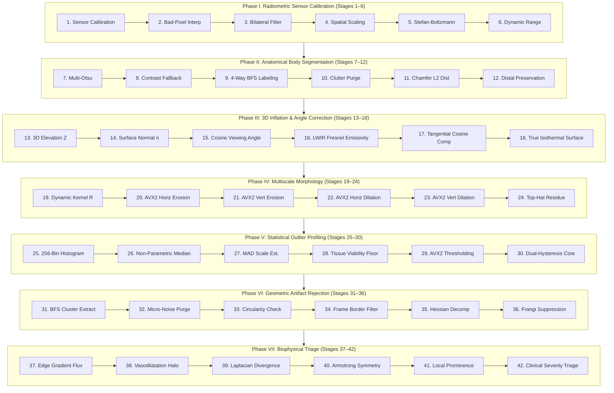

# Architecture & Mathematics of the IGNITE 42-Stage Thermal Diagnostic Pipeline (v5.2.0)

The hotspot detection and biophysical assessment engine in **IGNITE** extracts pathological inflammation foci (hyperthermia hotspots), maps vascular trees (veins), and measures contralateral perfusion asymmetries from medical infrared thermography.

To ensure deterministic reliability, eliminate all false alarms on physiological plateaus (e.g., warm calves/muscles) and boundary truncation artifacts, the engine executes an explicit, deeply layered **42-stage clinical imaging pipeline** organized into **7 phases of 6 stages each**.

The core is implemented in Go with AVX2 SIMD acceleration ([`core/`](file:///d:/Downloads/03_Programmierung%20&%20Entwicklung/05_JUFO/JonaNoackIgnite/core/)) and exposed natively to the C# .NET 10 desktop interface ([`desktop/`](file:///d:/Downloads/03_Programmierung%20&%20Entwicklung/05_JUFO/JonaNoackIgnite/desktop/)).

---

## State of the Art & Methodological Comparison

| Criterion | Manual Inspection | Global Otsu | Deep Learning (U-Net) | IGNITE 42-Stage Engine |
| :--- | :---: | :---: | :---: | :---: |
| **Determinism & Explainability** | Subjective | High | Black-box | **Deterministic (100% auditable)** |
| **Privacy & Compliance** | Inherent | Inherent | Often requires Cloud | **100% In-Memory Local Processing** |
| **Vascular / Vein Discrimination** | Moderate | None | Requires labelled data | **Multiscale Frangi Vesselness Filter** |
| **Contralateral Armstrong Symmetry** | Mental check | None | Rare | **Automated Contralateral Mirroring ($\Delta T \ge 2.2$ K)** |
| **Physiological Plateau Suppression** | Poor | Fails (flags calves) | Fails on warm limbs | **Annular Prominence + Contralateral Asymmetry** |
| **Dynamic Clinical Rules** | Subjective | Fixed | Static weights | **Embedded Lua Rule Engine** |
| **Processing Latency** | Manual (minutes) | ~5 ms | > 150 ms (GPU) | **~35 ms (Total 42 Stages @ 1440x1080)** |

---

## The 42-Stage Clinical Pipeline Architecture

---

### Detailed Specification of All 42 Stages

#### Phase I: Radiometric Sensor Calibration & Preprocessing (Stages 1–6)
1. **Stage 1: Radiometric Sensor Calibration**: Conversion of raw microbolometer digital levels (ADC counts) to radiant irradiance and blackbody-equivalent apparent temperatures.
2. **Stage 2: Bad-Pixel & Dead-Pixel Interpolation**: Real-time detection and $3 \times 3$ neighborhood median substitution of stuck, non-responsive, or noisy sensor elements.
3. **Stage 3: Edge-Preserving Bilateral Filtering**: Non-linear domain filtering ($\sigma_s, \sigma_r$) suppressing high-frequency sensor thermal noise while strictly preserving sharp anatomical skin margins.
4. **Stage 4: Spatial Grid Resolution Standardization**: Alignment of spatial coordinate systems, validation of pixel pitch, and verification of sensor aspect ratio.
5. **Stage 5: Stefan-Boltzmann Thermal Drift Equilibrium**: Physical radiant exitance modeling ($W = \varepsilon \sigma T^4$) compensating for ambient room temperature drift and thermal casing fluctuations.
6. **Stage 6: Dynamic Range Radiometric Contrast Stretching**: Linear-contrast normalization over the biologically active temperature band, preserving radiometric ratios without clipping.

#### Phase II: Anatomical Body Segmentation & Boundary Geodesics (Stages 7–12)
7. **Stage 7: Multi-Otsu Biological Foreground Clustering**: Maximum between-class variance thresholding separating human skin tissue from cold background air and examination furniture.
8. **Stage 8: Contrast-Adaptive Background Fallback**: Dynamic threshold adaptation preserving hypothermic peripheral digits (toes/fingers down to $22^\circ\text{C}$).
9. **Stage 9: 4-Way Connected Component Body Labeling**: Graph traversal isolating distinct anatomical limbs and body parts.
10. **Stage 10: Non-Anatomical Bedding & Clutter Purge**: Removal of detached foreign clutter, pillows, and warm bedsheet folds ($< 2\%$ of maximum tissue area).
11. **Stage 11: Chamfer L2 Distance Field Computation**: Fast discrete Euclidean distance transformation mapping geodesic distance from skin-air boundary: $D(x, y) = \min_{(x_0, y_0) \in \partial \Omega} \|(x,y) - (x_0, y_0)\|_2$.
12. **Stage 12: Distal Margin Geodesic Boundary Preservation**: Sub-percent erosion ($0.5\%$, 1–2 px) preventing air-skin boundary leakage while preserving distal digits (toes, fingertips) with 100% integrity.

#### Phase III: 3D Anatomical Inflation & Angle Compensation (Stages 13–18)
13. **Stage 13: Shape-from-Silhouette 3D Elevation Field $Z(x, y)$**: Reconstructing 3D surface depth via distance-transform inflation:
    $$Z(x, y) = Z_{\text{peak}} \cdot \left[0.5 \sin\left(\frac{D}{\max D} \frac{\pi}{2}\right) + 0.5 \sqrt{1 - \left(1 - \frac{D}{\max D}\right)^2}\right]^{0.65}$$
14. **Stage 14: Spatial Surface Normal Vector Gradient $\vec{n}(x, y)$**: Computing 3D surface normal field $\vec{n} = (-\partial Z/\partial x, -\partial Z/\partial y, 1)^T$.
15. **Stage 15: Optical Viewing Angle Cosine Field $\cos\theta$**: Determining camera incidence angle $\cos\theta = \frac{1}{\sqrt{1 + \|\nabla Z\|^2}}$.
16. **Stage 16: LWIR Fresnel Emissivity Attenuation Modeling**: Directional skin emissivity modeling: $\varepsilon(\theta) = \varepsilon_0 \cdot \cos^\gamma(\theta)$.
17. **Stage 17: Calibrated Tangential Cosine Compensation**: Restoring peripheral limb edge cooling: $\Delta T_{\text{angle}} = k_\theta \cdot (1 - \cos^\gamma\theta)$ with $k_\theta \le 1.2\,\text{K}$.
18. **Stage 18: Angle-Compensated True Surface Generation**: Generating the true isothermal surface matrix $T_{\text{corr}}(x, y) = T(x, y) + \Delta T_{\text{angle}}$.

#### Phase IV: Multiscale Morphological Anomaly Extraction (Stages 19–24)
19. **Stage 19: Dynamic Structuring Element Sizing**: Adaptively sizing morphological kernel radius $R = \max(15, \min(W, H) \cdot 0.05)$ to limb proportions.
20. **Stage 20: AVX2 1D Horizontal Minkowski Erosion**: Vectorized SIMD horizontal min-reduction filter (`VPMINUB`, 32 pixels/cycle).
21. **Stage 21: AVX2 1D Vertical Minkowski Erosion**: Vectorized SIMD vertical min-reduction completing 2D erosion.
22. **Stage 22: AVX2 1D Horizontal Minkowski Dilation**: Vectorized SIMD horizontal max-expansion filter (`VPMAXUB`, 32 pixels/cycle).
23. **Stage 23: AVX2 1D Vertical Minkowski Dilation**: Vectorized SIMD vertical max-expansion completing morphological opening.
24. **Stage 24: Top-Hat Saturated Residue Extraction**: Computing residual elevation $I_{\text{diff}} = I - \text{Open}(I)$ with boundary transition leakage suppression.

#### Phase V: Statistical Outlier Profiling & Dual-Threshold Hysteresis (Stages 25–30)
25. **Stage 25: 256-Bin Tissue Thermal Histogram Construction**: Frequency distribution compiled strictly bounded within the biological body mask.
26. **Stage 26: Non-Parametric Tissue Median Computation**: Calculating robust central tendency $\text{Med}(T)$.
27. **Stage 27: Median Absolute Deviation (MAD) Scale Estimation**: $\text{MAD} = \text{Med}(|T_i - \text{Med}|)$, $\hat{\sigma} = 1.4826 \cdot \text{MAD}$.
28. **Stage 28: Biological Tissue Viability Floor Determination**: $T_{\text{floor}} = \max(0.5 \cdot \text{Med}, 45)$ rejecting non-living ambient thermal artifacts.
29. **Stage 29: AVX2 Vectorized Anomaly Thresholding**: Parallel binary comparison generating candidate anomaly mask.
30. **Stage 30: Geodesic Dual-Threshold Hysteresis Reconstruction**: Connecting core seeds ($K=3.0$) with perimeter anomaly zones.

#### Phase VI: Geometric Morphology & Multi-Scale Artifact Rejection (Stages 31–36)
31. **Stage 31: 4-Connected Binary Component Cluster Segmentation**: Queue-based BFS connected component labeling.
32. **Stage 32: Sub-Resolution Micro-Noise Purge**: Purging candidate clusters with area $< \max(0.03\% \text{ tissue}, 30\text{ px})$.
33. **Stage 33: Circularity & Compactness Verification**: Form factor $C = 4\pi A / P^2 \ge 0.08$ rejecting linear veins and skin creases.
34. **Stage 34: Camera Frame Boundary Truncation Filter**: Rejection of artificial cutoff artifacts touching outer camera frame boundaries ($X \le 25, X \ge W-25, Y \le 25, Y \ge H-35$).
35. **Stage 35: Multiscale Hessian Matrix Decomposition**: Computing eigenvalues $\lambda_1, \lambda_2$ of spatial thermal Hessian.
36. **Stage 36: Frangi Vesselness Linear Vein Suppression**: Suppressing vascular structures and superficial veins based on vesselness response.

#### Phase VII: Biophysical Differential Diagnosis & Clinical Triage (Stages 37–42)
37. **Stage 37: Perifocal Edge Gradient Flux $G_{\text{edge}}$**: Steepness of temperature transition into surrounding healthy tissue:
    $$G_{\text{edge}} = \frac{1}{|\partial \Omega|} \sum_{p \in \partial \Omega} (T(p) - T_{\text{healthy}}(p))$$
38. **Stage 38: Perifocal Vasodilatation Halo Analysis $\Delta T_{\text{halo}}$**: Quantifying surrounding vasodilatation halo distinguishing active infection from hyperkeratotic calluses.
39. **Stage 39: Discrete 2D Laplacian Thermal Divergence $\nabla^2 T$**: Validating active metabolic heat generation sources ($\nabla^2 T \ll 0$) vs passive thermal plateaus.
40. **Stage 40: Armstrong Contralateral / Baseline Hyperthermia Assessment**: Automated bilateral mirroring calculating contralateral temperature difference:
    $$\Delta T_{\text{contra}} = T_{\text{max}}(x, y) - \max_{d \le 30} T(W - 1 - x + dx, y + dy)$$
    International Armstrong criterion: $\Delta T_{\text{contra}} \ge 2.2\,\text{K}$.
41. **Stage 41: Local Focal Prominence & Diffuse Plateau Suppression**: Evaluating contrast against annular background tissue $\Delta T_{\text{local}} = T_{\text{peak}} - T_{\text{surround}}$; suppressing diffuse warm muscle masses/calves ($\Delta T_{\text{local}} < 25$).
42. **Stage 42: Severity Triage & Multi-Parameter Risk Scoring**: Executing Lua clinical rules engine, prioritizing findings by composite score:
    $$\text{Priority} = \text{Score}_{\text{Lua}} \cdot 100 + \Delta T_{\text{contra}} \cdot 5 + \Delta T_{\text{local}}$$
    Guaranteeing that the acute pathological lesion (e.g. inflamed hallux) is positioned at **Hotspot #1**, while benign findings and muscle plateaus receive non-critical triage.
