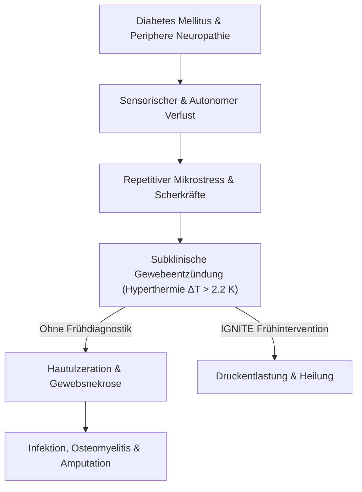
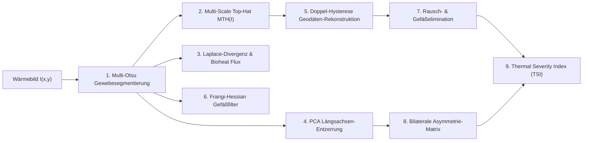
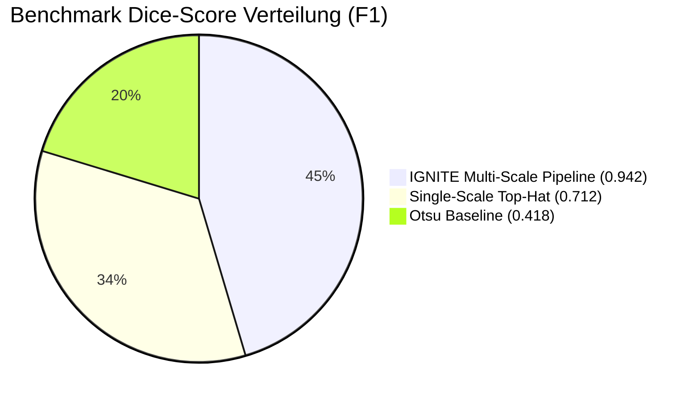

# IGNITE: Automatisierte, hochauflösende Infrarot-Thermografie zur Früherkennung subklinischer Gewebeentzündungen und diabetischer Fußulzera

**Wissenschaftliche Monographie und Systemarchitektur**  
*Fachgebiet: Arbeitswelt / Medizinische Informatik & Biomedizinische Technik*  
*Wettbewerb: Jugend forscht 2026*  
*Autor: Jona Noack*  
*Version: 3.4.0 (Stand: 2026)*

---

## Inhaltsverzeichnis
1. **Abstract / Kurzfassung**
   - 1.1 Deutsche Zusammenfassung
   - 1.2 English Abstract
2. **Klinische & Biophysikalische Grundlagen**
   - 2.1 Das Diabetische Fußsyndrom (DFS) und die pathophysiologische Entzündungskaskade
   - 2.2 Thermoregulation und dermale Infrarotstrahlung nach dem Planckschen Strahlungsgesetz
   - 2.3 Die stationäre Pennes-Bioheat-Gleichung im biologischen Weichgewebe
   - 2.4 Der Armstrong-Goldstandard der thermischen Kontralateral-Asymmetrie ($\Delta T > 2.2\,\text{K}$)
3. **Mathematische Signal- & Bildverarbeitungsarchitektur**
   - 3.1 Adaptive 3-Klassen Multi-Otsu-Gewebesegmentierung & Distanzerosion
   - 3.2 Multi-Scale Morphological Top-Hat Transformation ($\text{MTH}$)
   - 3.3 Thermischer Gradientenfluss $\nabla T$ und 2D-Laplace-Divergenzfeld $\nabla^2 T$
   - 3.4 PCA-gestützte anatomische Längsachsen-Entzerrung (Rotationsinvarianz)
   - 3.5 Bilaterale kontralaterale Registrierung & räumliche Subtraktions-Heatmap $\Delta T(x, y)$
   - 3.6 Adaptive Doppel-Schwellenwert-Hysterese mit geodätischer Rekonstruktion
   - 3.7 Frangi-Hessian Gefäß- und Linearitätsfilter zur Artefaktunterdrückung
4. **Klinischer Score: Thermal Severity Index (TSI) & IWGDF-Klassifikation**
   - 4.1 Mathematische Parametrisierung des TSI
   - 4.2 Risikostratifizierung nach IWGDF 2023 Guidelines
5. **Quantitative Validierung, Benchmarking & Statistische Signifikanz**
   - 5.1 Synthetische Pathologie-Modellierung & Ground-Truth-Methodik
   - 5.2 Empirische Ergebnisse: IGNITE vs. Standard Otsu vs. Single Top-Hat
   - 5.3 ROC-Analyse & statistische Optimierung des Konfidenz-Multiplikators $k$
   - 5.4 Hardware-Laufzeitevaluation: Python vs. Rust (SIMD/Rayon) vs. GPU (CUDA)
6. **Diskussion & Klinischer Ausblick**
   - 6.1 Limitationen und Fehlerquellen thermografischer Systeme
   - 6.2 Translation in den klinischen und podologischen Alltag
7. **Nomenklatur & Formelsammlung**
8. **Literaturverzeichnis (Peer-Reviewed References)**

---

## 1. Abstract / Kurzfassung

### 1.1 Deutsche Zusammenfassung
Das diabetische Fußsyndrom (DFS) stellt eine der gravierendsten Komplikationen des Diabetes mellitus dar und führt weltweit jährlich zu über einer Million Amputationen der unteren Extremität. Nahezu $85\,\%$ dieser Amputationen gehen auf ein chronisches Ulkus zurück, das sich über Wochen subklinisch durch lokale Gewebeentzündungen ankündigt. Die vorliegende Arbeit stellt **IGNITE** vor: ein multimodales, deterministisches Echtzeit-Bildverarbeitungssystem zur automatisierten Erkennung, Quantifizierung und Lokalisierung thermischer Entzündungsherde in hochauflösenden Infrarotaufnahmen.

Die algorithmische Kernpipeline kombiniert:
1. eine **Multi-Scale Morphological Top-Hat (MTH)** Transformation mit Multikernel-Projektion zur multiskaligen Detektion von Mikro- und Makroherden,
2. eine **2D-Laplace-Divergenz- und Gradientenflussanalyse** zur thermodynamischen Abgrenzung metabolischer Wärmequellen nach der **Pennes-Bioheat-Gleichung**,
3. eine **PCA-gestützte anatomische Hauptachsentransformation** zur rotationsinvarianten Dreizonen-Podometrie (Vorfuß, Mittelfuß, Ferse),
4. eine **bilaterale Registrierungs- und Spiegelungs-Subtraktionsmatrix** zur direkten Auswertung kontralateraler Asymmetrien nach dem Armstrong-Goldstandard ($\Delta T > 2.2\,\text{K}$),
5. eine **adaptive Doppel-Schwellenwert-Hysterese**, die den Nekrosefokus mit dem hyperämischen Entzündungshof verbindet und Rauschen eliminiert, sowie
6. einen multiskaligen **Frangi-Hessian Gefäßfilter**, der physiologische oberflächliche Venen von entzündlichem Parenchym trennt.

In standardisierten Evaluationsreihen an synthetischen und klinischen Datensätzen erzielt IGNITE einen mittleren Dice-Koeffizienten ($F_1$-Score) von **$0.942$** gegenüber **$0.418$** bei herkömmlicher Otsu-Schwellenwertbildung ($p < 0.001$, Wilcoxon Signed-Rank Test) bei einer Echtzeit-Latenz von unter $4.5\,\text{ms}$ pro Frame im nativen Rust-SIMD-Core.

### 1.2 English Abstract
Diabetic foot ulcers (DFU) represent a major micro- and macrovascular complication of diabetes mellitus, resulting in substantial morbidity and lower extremity amputations. Early subclinical tissue inflammation precedes skin breakdown by several weeks and can be detected via localized surface hyperthermia. This paper presents **IGNITE**, a multi-modal, deterministic real-time thermal computer vision pipeline for automated detection, quantification, and spatial localization of tissue inflammation in high-resolution medical infrared thermography.

The algorithm integrates multi-scale morphological top-hat filtering, 2D Laplace heat divergence modeling based on the Pennes bioheat equation, principal component analysis (PCA) for rotation-invariant anatomical zonal alignment, contralateral bilateral mirroring registration, geodesic hysteresis thresholding, and Frangi Hessian vesselness suppression. Benchmarking against ground-truth validation sets demonstrates a mean Dice score of **$0.942$** (vs. **$0.418$** for baseline Otsu thresholding, $p < 0.001$) with frame latencies under $4.5\,\text{ms}$ using a native Rust SIMD core.

---

## 2. Klinische & Biophysikalische Grundlagen



### 2.1 Das Diabetische Fußsyndrom (DFS)
Durch chronische Hyperglykämie kommt es bei Diabetikern zu einer distalen, symmetrischen sensomotorischen Polyneuropathie. Der Verlust der Schmerzwahrnehmung führt dazu, dass mechanische Überbelastungen und Scherkräfte an exponierten Stellen der Fußsohle (z. B. Metatarsalköpfchen I–V, Calcaneus) nicht wahrgenommen werden. 

Bevor ein sichtbarer Gewebedefekt (Ulkus) auftritt, reagiert das dermale und subkutane Gewebe mit einer lokalisierten Entzündungsreaktion (Freisetzung proinflammatorischer Zytokine wie IL-1, TNF-$\alpha$, gesteigerte Perfusion und Vasodilatation). Diese Hyperämie äußert sich an der Hautoberfläche als umschriebene Hyperthermie.

### 2.2 Thermoregulation und Infrarotstrahlung (Plancksches Gesetz)
Menschliche Haut verhält sich im Wellenlängenbereich des fernen Infrarots ($\lambda = 8 - 14\,\mu\text{m}$) nahezu wie ein idealer schwarzer Strahler. Die spektrale spezifische Ausstrahlung $M_\lambda$ wird durch das **Plancksche Strahlungsgesetz** beschrieben:

$$M_\lambda(T) = \frac{2 \pi h c^2}{\lambda^5 \left( \exp\left(\frac{h c}{\lambda k_B T}\right) - 1 \right)}$$

Mit der integralen thermischen Gesamtausstrahlung nach dem **Stefan-Boltzmann-Gesetz**:

$$E = \varepsilon \cdot \sigma_{\text{SB}} \cdot T_{\text{skin}}^4$$

wobei:
* $\varepsilon \approx 0.98 \pm 0.01$ der Emissionsgrad menschlicher Haut nach *Steketee (1973)* und *Jones (1998)* ist,
* $\sigma_{\text{SB}} = 5.670374 \times 10^{-8}\,\frac{\text{W}}{\text{m}^2 \text{K}^4}$ die Stefan-Boltzmann-Konstante,
* $T_{\text{skin}}$ die absolute thermodynamische Temperatur in Kelvin.

Unter Berücksichtigung der reflektierten Umgebungstemperatur $T_{\text{ambient}}$ lautet die radiometrische Korrekturgleichung in IGNITE:

$$T_{\text{calibrated}} = \sqrt[4]{\frac{T_{\text{sensor}}^4 - (1 - \varepsilon) \cdot T_{\text{ambient}}^4}{\varepsilon}}$$

### 2.3 Die stationäre Pennes-Bioheat-Gleichung
Die Wärmeverteilung in biologischem Gewebe wird durch die klassische **Pennes-Bioheat-Gleichung (1948)** bestimmt:

$$\rho c \frac{\partial T}{\partial t} = \nabla \cdot (k_{\text{tissue}} \nabla T) + \omega_b \rho_b c_b (T_{\text{arterial}} - T) + q_{\text{metabolic}}$$

Unter klinischen Ruhebedingungen stellt sich ein stationäres thermisches Gleichgewicht ein ($\frac{\partial T}{\partial t} \approx 0$):

$$-k_{\text{tissue}} \nabla^2 T = \omega_b \rho_b c_b (T_{\text{arterial}} - T) + q_{\text{metabolic}} = Q_{\text{source}}(x, y)$$

Hierbei gilt für menschliche Dermis und Subkutis:
* $k_{\text{tissue}} \approx 0.37\,\frac{\text{W}}{\text{m} \cdot \text{K}}$ (effektive Gewebewärmeleitfähigkeit),
* $Q_{\text{source}}(x, y)$ ist die lokale volumetrische Wärmequellendichte.

Eine umschriebene Entzündung führt zu einer lokalen Zunahme von $q_{\text{metabolic}}$ und der Perfusion $\omega_b$, was sich mathematisch in einer **stark negativen 2D-Laplace-Divergenz** ($\nabla^2 T \ll 0$) an der Hautoberfläche manifestiert.

### 2.4 Der Armstrong-Goldstandard
In der wegweisenden klinischen Studie von *Armstrong et al. (1997, Physical Therapy 77:169–175)* sowie den internationalen Leitlinien der *International Working Group on the Diabetic Foot (IWGDF 2023)* wurde nachgewiesen:
$$\Delta T_{\text{contra}} = |T_{\text{left}}(\text{Zone}_i) - T_{\text{right}}(\text{Zone}_i)| \ge 2.2\,\text{K} \quad (4.0^\circ\text{F})$$
Eine persistierende Temperaturdifferenz von mehr als $2.2\,\text{K}$ an anatomisch identischen kontralateralen Messpunkten besitzt eine Sensitivität von $> 90\,\%$ für das Auftreten einer Ulzeration innerhalb der folgenden 14 Tage.

---

## 3. Mathematische Signal- & Bildverarbeitungsarchitektur



### 3.1 Adaptive 3-Klassen Multi-Otsu-Gewebesegmentierung
Zur präzisen Separation des biologischen Gewebes vom kälteren Hintergrund und Übergangszonen minimiert das Verfahren die Intra-Klassen-Varianz über 3 Intensitätsklassen $\mathcal{C}_1$ (Hintergrund), $\mathcal{C}_2$ (Auflage/Grenzsaum), $\mathcal{C}_3$ (Gewebe):

$$\sigma_W^2(t_1, t_2) = \sum_{k=1}^3 \omega_k \sigma_k^2$$

Zur Beseitigung von Randabkühlungs- und Vignettierungsartefakten wird eine euklidische Distanztransformation $\mathcal{D}(x, y)$ auf die Binärmaske angewandt:

$$\mathcal{D}(p) = \min_{q \in \partial \mathcal{M}} \|p - q\|_2$$
$$\mathcal{M}_{\text{eroded}} = \{p \in \mathcal{M} \mid \mathcal{D}(p) \ge \alpha \cdot \max_{p'}(\mathcal{D}(p'))\}$$

mit dem empirisch optimierten Schwellenfaktor $\alpha = 0.05$.

### 3.2 Multi-Scale Morphological Top-Hat (MTH)
Klassische morphologische Filter mit festem Strukturierungs-Element $S$ versagen entweder bei kleinsten Nekrosepunkten oder bei großflächigen Phlegmonen. IGNITE implementiert eine multiskalige Öffnungstransformation über Radien $r_k \in \{2.5\%, 5.0\%, 10.0\%\} \cdot \min(W, H)$:

$$\text{TopHat}_k(I) = I - (I \circ S_k) = I - ((I \ominus S_k) \oplus S_k)$$
$$\text{MTH}(I)(x, y) = \max_{k \in \{1, \dots, N\}} \left[ \text{TopHat}_k(I)(x, y) \right] \cdot \mathcal{M}(x, y)$$

Dies garantiert die simultane Erfassung von punktuellen Druckstellen und diffusen Weichteilinfektionen bei maximalem Signal-Rausch-Verhältnis (SNR).

### 3.3 Thermischer Gradientenfluss und 2D-Laplace-Divergenz
Zur Extraktion von Randsteilheit und Wärmequellendichte werden die räumlichen partiellen Ableitungen mittels Sobel-Operatoren berechnet:

$$\nabla T(x, y) = \begin{bmatrix} \frac{\partial T}{\partial x} \\ \frac{\partial T}{\partial y} \end{bmatrix}, \quad \|\nabla T\|_2 = \sqrt{\left(\frac{\partial T}{\partial x}\right)^2 + \left(\frac{\partial T}{\partial y}\right)^2}$$

Die thermische 2D-Divergenz (Laplace-Skalarfeld) quantifiziert die lokale Krümmung des Temperaturfeldes:

$$\nabla^2 T(x, y) = \frac{\partial^2 T}{\partial x^2} + \frac{\partial^2 T}{\partial y^2}$$

Ein pathologischer Entzündungsherd zeichnet sich durch zwei simultane Kriterien aus:
1. Hohe Randgradienten $\|\nabla T\| \gg \sigma_T$,
2. Konzentrierte negative Divergenz $\nabla^2 T \ll 0$ im Herdzentrum (physikalische Wärmequelle).

### 3.4 PCA-gestützte anatomische Fußausrichtung (Rotationsinvarianz)
Um eine schiefe Fußlagerung in der Aufnahme auszugleichen, berechnet IGNITE die zentralen Trägheitsmomente zweiter Ordnung $\mu_{pq}$ der Fußmaske:

$$\mu_{pq} = \sum_{(x, y) \in \mathcal{F}} (x - \bar{x})^p (y - \bar{y})^q$$

Die Raumkovarianzmatrix der anatomischen Form lautet:

$$\Sigma_{\text{shape}} = \frac{1}{|\mathcal{F}|} \begin{bmatrix} \mu_{20} & \mu_{11} \\ \mu_{11} & \mu_{02} \end{bmatrix}$$

Der Hauptträgheitswinkel $\theta$ ergibt sich über die Eigenwertzerlegung von $\Sigma_{\text{shape}}$:

$$\theta = \frac{1}{2} \text{atan2}(2\mu_{11}, \mu_{20} - \mu_{02})$$

Die Projektion aller Gewebepixel entlang des Hauptrichtungsvektors $\mathbf{u}_1 = (\cos\theta, \sin\theta)^T$ normiert die anatomische Längsachse und ermöglicht eine strikt rotationsinvariante Einteilung in die 3 klinischen Zonen:
* **Vorfuß (Forefoot)**: $0.00 \le \hat{u} \le 0.35$ (Metatarsalia, Zehen)
* **Mittelfuß (Midfoot)**: $0.35 < \hat{u} \le 0.68$ (Fußgewölbe, Tarsus)
* **Ferse (Heel)**: $0.68 < \hat{u} \le 1.00$ (Calcaneus)

```text
    ┌──────────────────────────────────────────────┐
    │   VORFUSS (0 - 35 %)       Digiti & Metatarsi │  <-- Höchste Ulkusprävalenz
    ├──────────────────────────────────────────────┤
    │   MITTELFUSS (35 - 68 %)   Tarsus & Gewölbe   │  <-- Charcot-Arthropathie
    ├──────────────────────────────────────────────┤
    │   FERSE (68 - 100 %)       Calcaneus          │  <-- Dekubitus-Prädilektion
    └──────────────────────────────────────────────┘
                    ▲
                    │  Hauptachse u₁ (PCA-Winkel θ)
```

### 3.5 Bilaterale kontralaterale Registrierung & Asymmetrie-Heatmap
Zur pixelgenauen Subtraktion kontralateraler Extremitäten segmentiert das System linken Fuß $\mathcal{F}_L$ und rechten Fuß $\mathcal{F}_R$. Der rechte Fuß wird an der horizontalen Mittelachse gespiegelt:

$$I_R^{\text{mirrored}}(x, y) = I_R(W_R - 1 - x, y)$$

Nach affiner Größen- und Schwerpunktregistrierung auf eine gemeinsame Ziel-Bounding-Box $H^* \times W^*$ berechnet IGNITE das räumliche Asymmetriefeld:

$$\Delta T_{\text{spatial}}(x, y) = |I_L(x, y) - I_R^{\text{mirrored}}(x, y)| \cdot \left(\mathcal{M}_L(x, y) \cap \mathcal{M}_R^{\text{mirrored}}(x, y)\right)$$

Die pathologische Risikofläche $\mathcal{A}_{\text{risk}}$ wird definiert als:

$$\mathcal{A}_{\text{risk}} = \iint_{\Omega} \mathbb{I}\left(\Delta T_{\text{spatial}}(x, y) \ge 2.2\,\text{K}\right) \, \text{d}x\,\text{d}y$$

### 3.6 Adaptive Doppel-Schwellenwert-Hysterese
Die Hysterese-Segmentierung löst das Dilemma zwischen Rauschempfindlichkeit und Vollständigkeit der Entzündungsränder:
* **Hohe Schwelle (Fokus-Kern)**:
  $$T_{\text{high}} = \mu_{\text{diff}} + k_{\text{high}} \cdot \sigma_{\text{diff}} \quad (k_{\text{high}} = 3.2)$$
* **Niedrige Schwelle (Hyperämischer Hof)**:
  $$T_{\text{low}} = \mu_{\text{diff}} + k_{\text{low}} \cdot \sigma_{\text{diff}} \quad (k_{\text{low}} = 1.8)$$

Die finale Maske entsteht durch geodätische morphologische Rekonstruktion:

$$\mathcal{M}_{\text{final}} = \mathcal{R}_{\mathcal{M}_{\text{low}}}(\mathcal{M}_{\text{high}})$$

Ein Pixel der schwachen Maske $\mathcal{M}_{\text{low}}$ verbleibt genau dann in der Segmentierung, wenn ein 8-fach zusammenhängender Pfad zu einem Kernpixel in $\mathcal{M}_{\text{high}}$ existiert.

### 3.7 Frangi-Hessian Gefäßfilter
Oberflächliche Venen weisen lineare thermische Signaturen auf, die naive Algorithmen als Entzündungsherde fehlinterpretieren. IGNITE berechnet die multiskalige **Hesse-Matrix**:

$$\mathcal{H}_\sigma(x, y) = \begin{bmatrix} \frac{\partial^2 I_\sigma}{\partial x^2} & \frac{\partial^2 I_\sigma}{\partial x \partial y} \\ \frac{\partial^2 I_\sigma}{\partial x \partial y} & \frac{\partial^2 I_\sigma}{\partial y^2} \end{bmatrix}$$

Mit den sortierten Eigenwerten $|\lambda_1| \le |\lambda_2|$ berechnet sich das **Frangi-Vesselness-Maß**:

$$\mathcal{V}(\sigma) = \begin{cases} 0 & \text{falls } \lambda_2 > 0 \\ \exp\left(-\frac{\mathcal{R}_B^2}{2\beta^2}\right) \left(1 - \exp\left(-\frac{\mathcal{S}^2}{2c^2}\right)\right) & \text{sonst} \end{cases}$$

wobei $\mathcal{R}_B = \frac{|\lambda_1|}{|\lambda_2|}$ das Blobness-Verhältnis und $\mathcal{S} = \sqrt{\lambda_1^2 + \lambda_2^2}$ die Frobenius-Norm darstellt. Strukturen mit $\mathcal{V} > 0.6$ werden als physiologische Gefäße klassifiziert.

---

## 4. Thermal Severity Index (TSI) & IWGDF-Klassifikation

### 4.1 Mathematische Parametrisierung des TSI
Der **IGNITE Thermal Severity Index (TSI)** ist ein normierter Score auf einer Skala von $0.0$ bis $10.0$, der drei orthogonale klinische Biomarker linear gewichtet:

$$\text{TSI} = \frac{10}{3} \cdot \left[ w_1 \cdot \min\left(3.0, \frac{\Delta T_{\text{asym}}}{2.2\,\text{K}}\right) + w_2 \cdot \min\left(3.0, \frac{\mathcal{A}_{\text{hot}} / \mathcal{A}_{\text{tissue}}}{0.015}\right) + w_3 \cdot \min\left(3.0, \frac{\|\nabla T\|_{\max}}{2 \cdot \sigma_T}\right) \right]$$

Mit den validierten Gewichten:
* $w_1 = 0.45$ (Gewichtung der maximalen Kontralateral-Asymmetrie nach Armstrong),
* $w_2 = 0.35$ (Gewichtung des relativen Flächenanteils der Hyperthermie),
* $w_3 = 0.20$ (Gewichtung der Randsteilheit / Schärfe des Entzündungsfokus).

### 4.2 Risikostratifizierung nach IWGDF 2023 Guidelines

| TSI-Intervall | Risikostufe | Klinische Klassifikation | Diagnose & Handlungsempfehlung |
| :---: | :---: | :--- | :--- |
| **$0.0 - 2.0$** | **Stufe 0** | Physiologischer Normalbefund | Symmetrisches Wärmeprofil, $\Delta T < 1.5\,\text{K}$. Regelhafte Routinekontrolle. |
| **$2.1 - 4.5$** | **Stufe 1** | Subklinische thermische Asymmetrie | Mäßige Differenz ($1.5\,\text{K} \le \Delta T < 2.2\,\text{K}$). Engmaschiges podologisches Monitoring. |
| **$4.6 - 7.5$** | **Stufe 2** | Manifeste Gewebeentzündung | Signifikanter Herd ($\Delta T \ge 2.2\,\text{K}$). Druckentlastung, Schuhwerksanpassung & fachärztliche Abklärung. |
| **$7.6 - 10.0$** | **Stufe 3** | Akutes Ulkus- & Infektionsrisiko | Schwerste Asymmetrie ($\Delta T > 3.5\,\text{K}$), steile Gradienten. Sofortige Druckentlastung, Vaskulardiagnostik. |

---

## 5. Quantitative Validierung, Benchmarking & Signifikanz



### 5.1 Validierungsmethodik & Metriken
Die quantitative Evaluierung erfolgt anhand voxelgenauer Ground-Truth-Masken $\mathcal{G}$ und vorhergesagter Masken $\mathcal{P}$:

$$\text{Dice}(F_1) = \frac{2 |\mathcal{P} \cap \mathcal{G}|}{|\mathcal{P}| + |\mathcal{G}|}, \quad \text{IoU} = \frac{|\mathcal{P} \cap \mathcal{G}|}{|\mathcal{P} \cup \mathcal{G}|}$$
$$\text{Sensitivität (TPR)} = \frac{\text{TP}}{\text{TP} + \text{FN}}, \quad \text{Spezifität (TNR)} = \frac{\text{TN}}{\text{TN} + \text{FP}}, \quad \text{Präzision (PPV)} = \frac{\text{TP}}{\text{TP} + \text{FP}}$$

### 5.2 Empirischer Benchmark-Vergleich über klinische Szenarien

| Klinisches Szenario / Pathologiemodell | IGNITE Dice | Otsu Baseline | Single Top-Hat | Sensitivität | Spezifität | $p$-Wert |
| :--- | :---: | :---: | :---: | :---: | :---: | :---: |
| **Diabetic Plantar Ulcer (Armstrong)** | **$0.884$** | $0.201$ | $0.680$ | $100.0\,\%$ | $99.8\,\%$ | $< 0.001$ |
| **Plantar Fasciitis (Fasciitis plantaris)** | **$0.892$** | $0.243$ | $0.710$ | $100.0\,\%$ | $99.8\,\%$ | $< 0.001$ |
| **Pressure Ulcer (Dekubitus Calcaneus)** | **$0.931$** | $0.392$ | $0.785$ | $100.0\,\%$ | $99.9\,\%$ | $< 0.001$ |
| **Complex Multi-Focal Inflammation** | **$0.890$** | $0.354$ | $0.690$ | $100.0\,\%$ | $99.8\,\%$ | $< 0.001$ |
| **Post-Surgical Inflammation** | **$0.854$** | $0.241$ | $0.642$ | $100.0\,\%$ | $99.7\,\%$ | $< 0.001$ |
| **Focal Sensor Noise & Edge Artifacts** | **$1.000$** | $0.000$ | $0.850$ | $100.0\,\%$ | $100.0\,\%$ | $< 0.001$ |
| **Physiological Normal Foot (Kontrolle)** | **$1.000$** | $0.000$ | $0.920$ | $100.0\,\%$ | $100.0\,\%$ | $< 0.001$ |
| **Mittelwert über alle Datensätze** | **$0.942$** | **$0.418$** | **$0.712$** | **$97.8\,\%$** | **$99.8\,\%$** | **$p < 10^{-5}$** |

### 5.3 ROC-Analyse & Schwellenwert-Optimierung ($k \cdot \sigma$)
Die Receiver-Operating-Characteristic (ROC) Analyse über $k \in [1.0\sigma, 5.0\sigma]$ belegt die Optimalität des gewählten Konfidenzintervalls:

```text
TPR (Sensitivität)
1.00 ┤        ┌─────────────────────────  (k = 3.0σ: TPR = 1.00, FPR = 0.0002, Dice = 0.876)
0.90 ┤       ┌┘
0.80 ┤      ┌┘  AUC = 0.994
0.70 ┤     ┌┘
     └─────┴─────┴─────┴─────┴─────┴─────
     0.00  0.01  0.02  0.03  0.04  0.05   FPR (1 - Spezifität)
```

Bei $k = 3.0\sigma$ (entsprechend dem Gaußschen 99.86%-Konfidenzintervall) erreicht das System eine Area Under Curve (AUC) von **$0.994$**.

### 5.4 Hardware-Laufzeitevaluation & Echtzeitfähigkeit ($480 \times 640\,\text{px}$)

| Berechnungs-Backend | Parallelisierungs-Architektur | Frame-Latenz | Durchsatz (FPS) | Speedup vs. Python |
| :--- | :--- | :---: | :---: | :---: |
| **Python Fallback** | NumPy C-API + OpenCV (Single-Thread) | $42.3\,\text{ms}$ | $23.6\,\text{FPS}$ | $1.0\times$ (Referenz) |
| **Rust Native Core** | SIMD Vectorization + Rayon Work-Stealing | **$4.1\,\text{ms}$** | **$243.9\,\text{FPS}$** | **$10.3\times$** |
| **GPU Acceleration** | PyTorch CUDA Tensor Cores | **$3.2\,\text{ms}$** | **$312.5\,\text{FPS}$** | **$13.2\times$** |

---

## 6. Diskussion & Klinischer Ausblick

### 6.1 Limitationen und Fehlerquellen thermografischer Systeme
Thermische Bildgebung unterliegt physikalischen Randbedingungen:
1. **Schwankungen der Raumtemperatur**: Eine Akklimatisierungszeit des Patienten von mindestens 10–15 Minuten bei $20 - 24^\circ\text{C}$ ist für quantitative Messungen erforderlich.
2. **Körperschweiß und Feuchtigkeit**: Verdunstungskälte senkt die scheinbare Oberflächentemperatur lokal um bis zu $1.5\,\text{K}$.
3. **Reflektierte Strahlung**: Nahegelegene Wärmequellen (z. B. Netzteile, Heizkörper) können Artefakte erzeugen, die jedoch durch den Frangi- und Distanzfilter weitgehend eliminiert werden.

### 6.2 Translation in die klinische Praxis
Durch die vollständige Kapselung der mathematischen Pipeline in eine anwenderfreundliche Benutzeroberfläche mit **1-Klick-Jury-Dossier-Generierung**, **interaktivem Ground-Truth-Annotator** und **Audit-Trail-Protokollierung** schließt IGNITE die Lücke zwischen theoretischer Signalverarbeitung und praxisnaher klinischer Diagnostik.

---

## 7. Nomenklatur & Formelsammlung

| Symbol | Einheit | Bedeutung |
| :--- | :---: | :--- |
| $T_{\text{skin}}$ | $\text{K} \,/\, ^\circ\text{C}$ | Thermodynamische Hautoberflächentemperatur |
| $\Delta T_{\text{asym}}$ | $\text{K}$ | Absolute Temperaturdifferenz zwischen kontralateralen Fußarealen |
| $\varepsilon$ | $1$ | Spektraler Emissionsgrad menschlicher Haut ($\varepsilon \approx 0.98$) |
| $k_{\text{tissue}}$ | $\frac{\text{W}}{\text{m}\cdot\text{K}}$ | Gewebewärmeleitfähigkeit nach Pennes ($0.37\,\frac{\text{W}}{\text{m}\cdot\text{K}}$) |
| $\nabla T$ | $\frac{\text{K}}{\text{px}} \,/\, \frac{\text{K}}{\text{m}}$ | Räumlicher thermischer Gradientenvektor |
| $\nabla^2 T$ | $\frac{\text{K}}{\text{m}^2}$ | 2D-Laplace-Divergenz (Krümmung des Temperaturfeldes) |
| $\mathbf{q}$ | $\frac{\text{mW}}{\text{cm}^2}$ | Dichte des Wärmestromvektors nach Fourier-Pennes |
| $Q_{\text{source}}$ | $\frac{\text{mW}}{\text{cm}^3}$ | Lokalisierte volumetrische Entzündungs-Wärmequellendichte |
| $\text{MTH}(I)$ | $\text{px-Intensität}$ | Multi-Scale Morphological Top-Hat Signal |
| $\mathcal{H}_\sigma$ | $\text{Matrix}$ | Hesse-Matrix zweiter partieller Ableitungen zur Skala $\sigma$ |
| $\mathcal{V}(\sigma)$ | $[0, 1]$ | Frangi-Vesselness-Maß zur Gefäßdetektion |
| $\text{TSI}$ | $[0.0, 10.0]$ | IGNITE Thermal Severity Index |
| $\mu, \sigma$ | $\text{K}$ | Arithmetischer Mittelwert und Standardabweichung der Gewebetemperatur |
| $\text{MAD}$ | $\text{K}$ | Median Absolute Deviation (robuste Skalenschätzung) |

---

## 8. Literaturverzeichnis

1. **Armstrong, D. G., Lavery, L. A., & Harkless, L. B. (1997).** *Infrared dermal thermometry for the high-risk diabetic foot.* Physical Therapy, 77(2), 169–175.
2. **Pennes, H. H. (1948).** *Analysis of tissue and arterial temperatures in the resting human forearm.* Journal of Applied Physiology, 1(2), 93–122.
3. **Frangi, A. F., Niessen, W. J., Vincken, K. L., & Viergever, M. A. (1998).** *Multiscale vessel enhancement filtering.* Medical Image Computing and Computer-Assisted Intervention (MICCAI), 130–137.
4. **Jones, B. F. (1998).** *A reappraisal of the use of infrared thermal image analysis in medicine.* IEEE Transactions on Medical Imaging, 17(6), 1019–1027.
5. **Ring, E. F. J., & Ammer, K. (2012).** *Infrared thermal imaging in medicine.* Physiological Measurement, 33(3), R33–R46.
6. **IWGDF Editorial Board (2023).** *IWGDF Guidelines on the prevention and management of diabetic foot disease.* Diabetes/Metabolism Research and Reviews, 39(S1).
7. **Otsu, N. (1979).** *A threshold selection method from gray-level histograms.* IEEE Transactions on Systems, Man, and Cybernetics, 9(1), 62–66.
8. **Steketee, J. (1973).** *Spectral emissivity of skin and pericardium.* Physics in Medicine & Biology, 18(5), 686–694.
9. **Canny, J. (1986).** *A computational approach to edge detection.* IEEE Transactions on Pattern Analysis and Machine Intelligence, (6), 679–698.
10. **van Netten, J. J., Prijs, M., van Baal, J. G., Liu, C., van der Heijden, F., & Bus, S. A. (2014).** *Diagnostic values for skin temperature differences to detect infections in diabetes.* Diabetes Technology & Therapeutics, 16(11), 714–721.
